Forms already handle a lot of dynamic behavior through deterministic code. RAG can help, but only
when the problem requires interpretation that rules and APIs cannot express. This guide is
practical and opinionated for architects building form-heavy systems.

<!--more-->

## Audience

- Angular, React, or similar frontend architects.
- .NET or backend engineers building form workflows.
- Teams in regulated domains like government, healthcare, legal, HR, or education.

## Baseline: what forms already do well

A typical demographic form collects:

- First name and last name.
- Parent or guardian information.
- Country -> State -> City.
- Address and postal code.

Traditional implementation:

```text
Country selected -> API call -> fetch states
State selected   -> API call -> fetch cities
City selected    -> API call -> fetch postal codes
```

This approach is deterministic, fast, cacheable, auditable, and easy to test. It does not need AI, and it does not need RAG.

## What RAG is (and is not) for forms

Retrieval-Augmented Generation (RAG) is a system where:

1. Relevant information is retrieved from knowledge sources.
2. A language model uses that context to generate a response.

In form-based applications, RAG is a read-only, assistive layer. It must never be authoritative, and it must never mutate state.

## The decision test

Ask one question:

"Can I clearly define the input -> output mapping in advance?"

If yes, use APIs, rules, configuration, lookup tables, or schema validation. If no, RAG becomes a candidate.

## Where RAG is overkill

| Requirement            | Best Tool      |
| ---------------------- | -------------- |
| Country -> States      | API            |
| State -> Cities        | API            |
| Postal code lookup     | API            |
| Address format         | Configuration  |
| Validation rules       | Schema / Regex |
| Mandatory fields       | Business rules |

RAG adds latency, cost, non-determinism, and testing complexity. Do not use it for dropdowns, validation, or reference data.

## Legitimate RAG use cases in form systems

### Contextual guidance (not data fetching)

Example: "Why is this address being rejected even though all fields are filled?"

RAG can retrieve internal policies and historical errors and generate a human-readable explanation.

### Domain-specific interpretation across jurisdictions

Global forms must handle different legal requirements and exceptions. RAG can retrieve country-specific documentation and explain why a field is required.

### Free-text inputs that drive structured outcomes

Example: "Describe your current living situation."

RAG can map free text to structured categories and suggest which sections of the form apply.

### Embedded knowledge in regulated workflows

Healthcare, legal, HR, and government forms often require policy context. RAG can surface the right guidance without exposing raw documents.

## Decision matrix: API vs rules vs RAG

| Scenario                 | Use This       |
| ------------------------ | -------------- |
| Deterministic lookup     | API            |
| Fixed rules              | Business logic |
| Known schema             | Validation     |
| Evolving documentation   | RAG            |
| Free-text interpretation | RAG            |
| User confusion           | RAG            |
| Regulatory explanations  | RAG            |

## Hybrid architecture (recommended)

RAG works best as an assistive layer, not a replacement for deterministic logic. Your form must still function if RAG is down.

```text
Form interaction
  -> Deterministic APIs and validation (authoritative)
  -> Optional RAG assistant (explain, guide, interpret)
```

Think of RAG as a senior colleague next to the form, not the database behind it.

## Reference architecture

### System context diagram

RAG runs in parallel to the transactional API path.

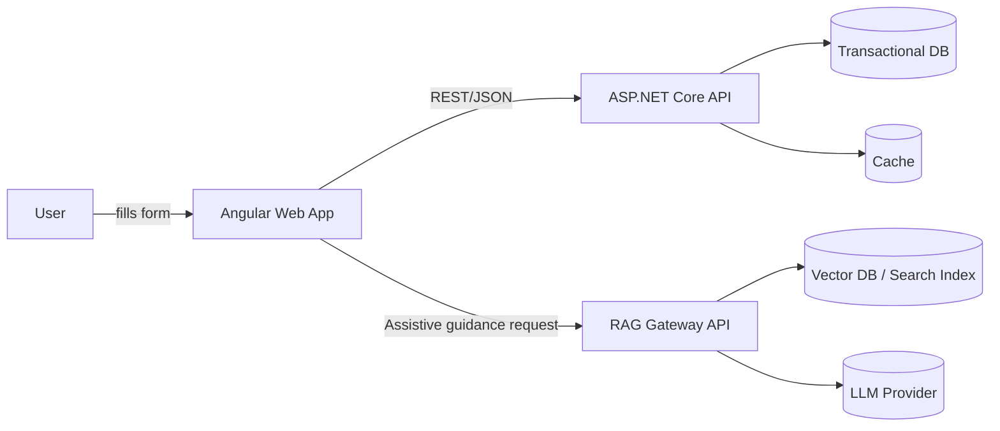

### Request flow: deterministic data vs RAG guidance

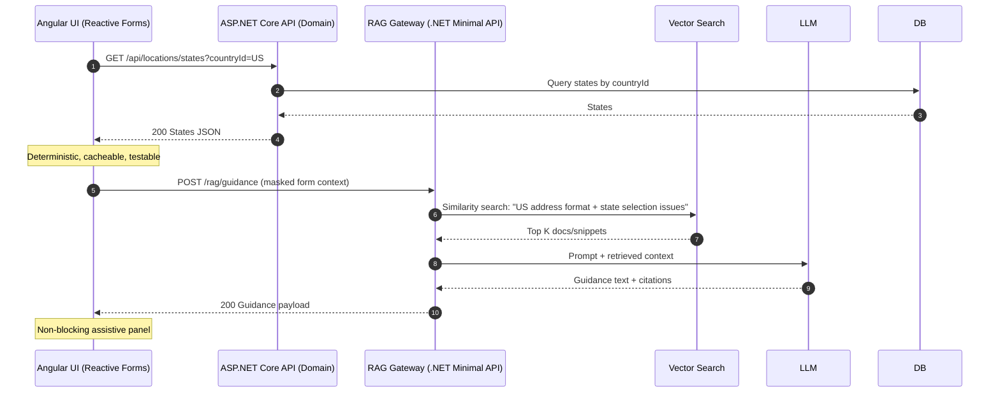

### Component architecture: clean boundaries

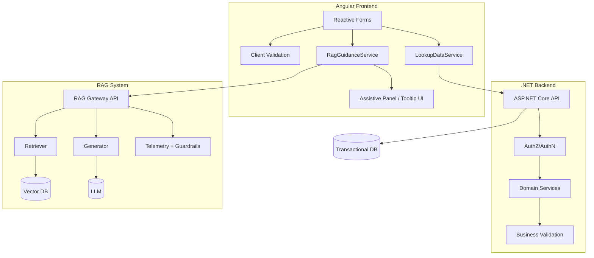

Key rule: RAG stays out of domain validation and persistence.

### Data classification and PII guardrail flow

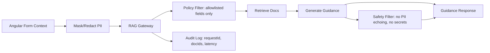

Implementation note:
- Do not send raw first/last name, full address, phone, SSN, or DOB to RAG without strong governance.
- Prefer field-level summarization ("Country=US, State empty, City filled, Zip invalid") over raw values.

### Deployment view (typical enterprise)

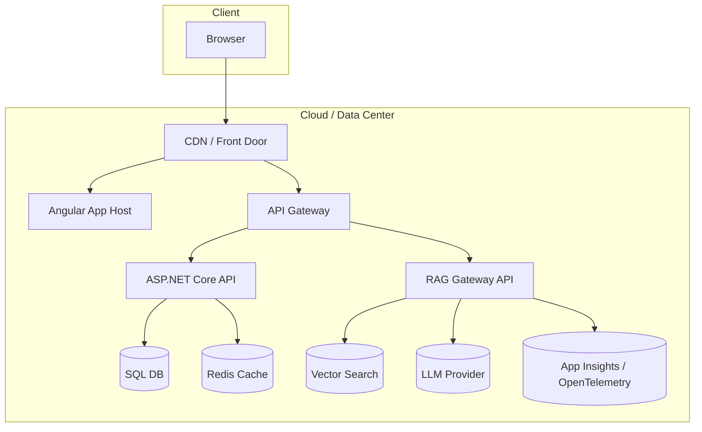

### Golden path: inline explanation for rejections

Use case: backend rejects submit; RAG explains why in human terms.

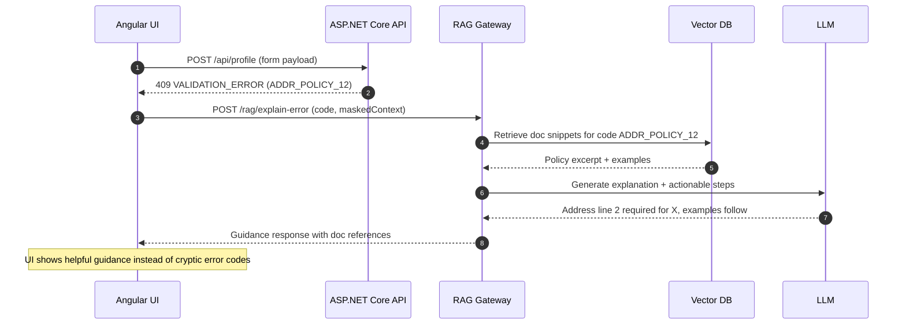

### RAG decision matrix as a flowchart

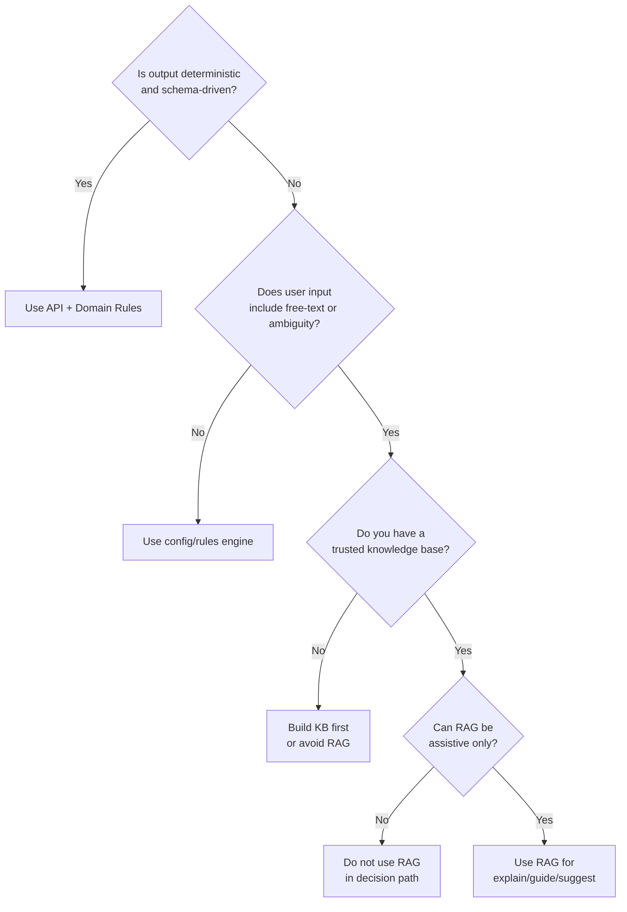

### Observability and governance (non-negotiable)

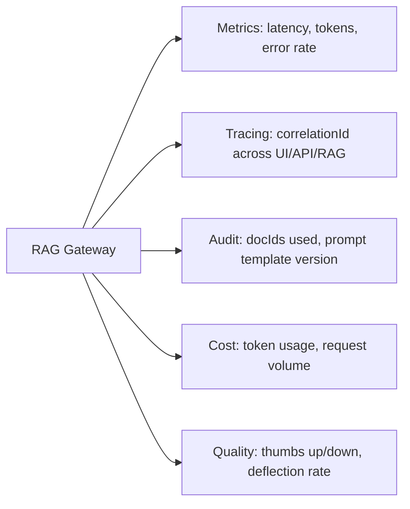

This is how you keep RAG from becoming a black box.

## C4 model reference 

### Context

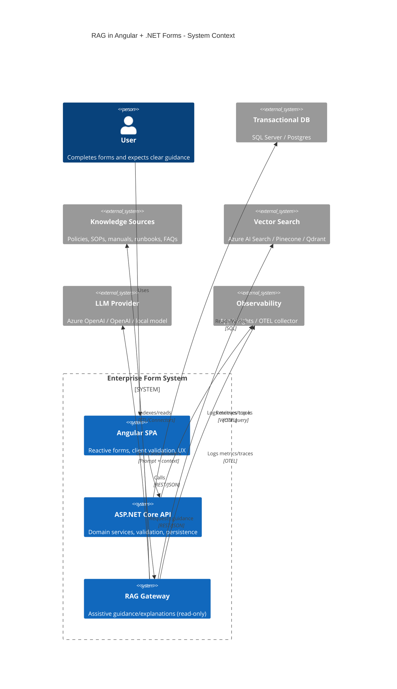

### Container

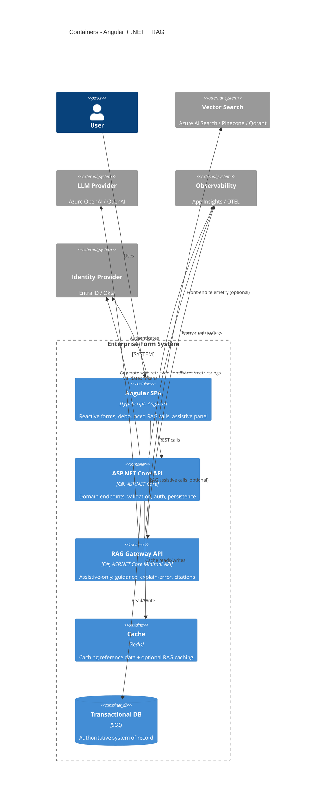

### Component (RAG Gateway internals)

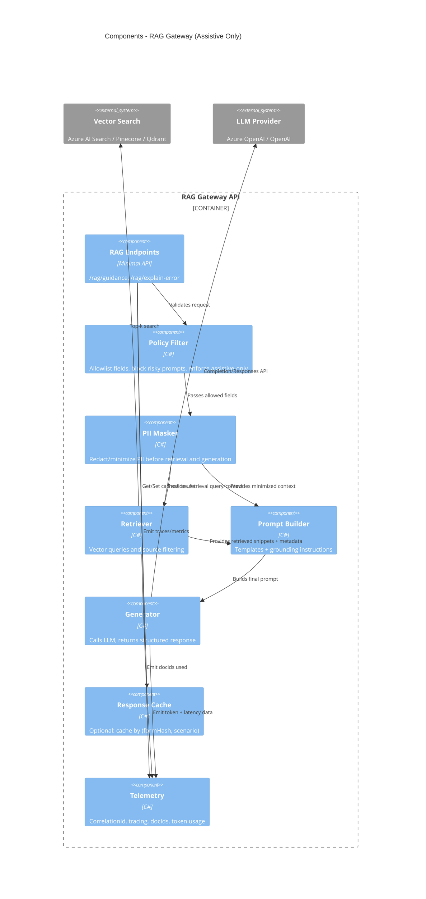

### Deployment

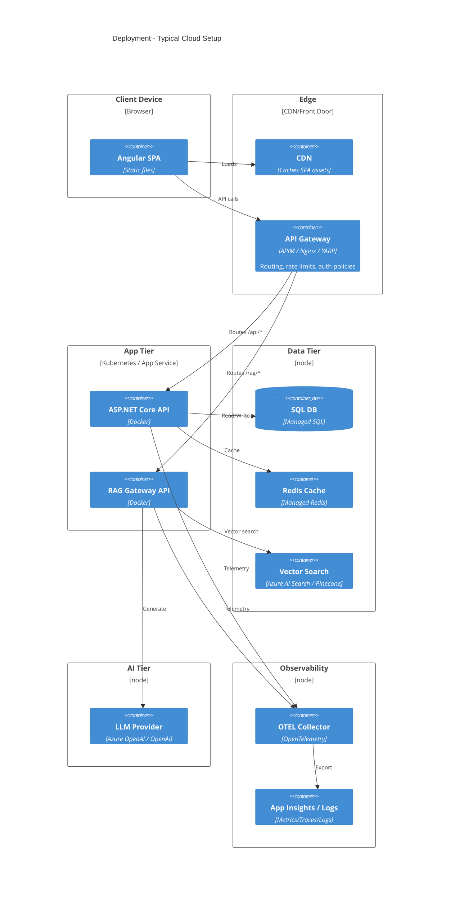

## .NET implementation skeleton (RAG Gateway)

This is a Minimal API skeleton you can use for reference.

### Contracts (DTOs)

```csharp
// Contracts/RagDtos.cs
namespace RagGateway.Contracts;

public sealed record RagGuidanceRequest(
    string Scenario,                 // e.g. "AddressAssist" or "ExplainError"
    Dictionary<string, object?> FormContext, // minimized client context
    string? ErrorCode = null,
    string? Locale = "en-US"
);

public sealed record RagCitation(
    string SourceId,     // doc id
    string Title,
    string Snippet,
    string? Url = null
);

public sealed record RagGuidanceResponse(
    string GuidanceMarkdown,
    IReadOnlyList<RagCitation> Citations,
    string CorrelationId
);
```

### Policy and masking (assistive-only + PII minimization)

```csharp
// Core/Policy/RequestPolicy.cs
namespace RagGateway.Core.Policy;

public sealed class RequestPolicy
{
    private static readonly HashSet<string> AllowedKeys = new(StringComparer.OrdinalIgnoreCase)
    {
        "countryId", "countryName",
        "stateId", "stateName",
        "city", "postalCode",
        "addressValidationResult",
        "fieldInFocus",
        "missingFields",
        "formStep",
        "uiErrorCode",
        "domain",
        "entityType"
    };

    public Dictionary<string, object?> Filter(Dictionary<string, object?> raw)
    {
        var filtered = new Dictionary<string, object?>(StringComparer.OrdinalIgnoreCase);
        foreach (var (k, v) in raw)
        {
            if (AllowedKeys.Contains(k))
                filtered[k] = v;
        }
        return filtered;
    }

    public void ValidateScenario(string scenario)
    {
        var allowed = new[] { "AddressAssist", "ExplainError", "FieldHelp" };
        if (!allowed.Contains(scenario, StringComparer.OrdinalIgnoreCase))
            throw new InvalidOperationException($"Scenario '{scenario}' not allowed.");
    }
}

// Core/Policy/PiiMasker.cs
namespace RagGateway.Core.Policy;

public sealed class PiiMasker
{
    public Dictionary<string, object?> Mask(Dictionary<string, object?> filtered)
    {
        var result = new Dictionary<string, object?>(StringComparer.OrdinalIgnoreCase);

        foreach (var (k, v) in filtered)
        {
            if (v is string s)
            {
                s = RedactEmail(s);
                s = RedactPhone(s);
                result[k] = s;
            }
            else
            {
                result[k] = v;
            }
        }

        return result;
    }

    private static string RedactEmail(string s) =>
        System.Text.RegularExpressions.Regex.Replace(s,
            @"[A-Z0-9._%+-]+@[A-Z0-9.-]+\.[A-Z]{2,}", "[REDACTED_EMAIL]",
            System.Text.RegularExpressions.RegexOptions.IgnoreCase);

    private static string RedactPhone(string s) =>
        System.Text.RegularExpressions.Regex.Replace(s,
            @"\\+?\\d[\\d\\-\\s\\(\\)]{7,}\\d", "[REDACTED_PHONE]");
}
```

### Retriever abstraction

```csharp
// Core/Retrieval/IRetriever.cs
namespace RagGateway.Core.Retrieval;

public sealed record RetrievedChunk(
    string SourceId,
    string Title,
    string Snippet,
    string? Url,
    float Score
);

public interface IRetriever
{
    Task<IReadOnlyList<RetrievedChunk>> RetrieveAsync(
        string scenario,
        Dictionary<string, object?> maskedContext,
        CancellationToken ct);
}
```

Example in-memory stub:

```csharp
// Infrastructure/Retrieval/InMemoryRetriever.cs
using RagGateway.Core.Retrieval;

namespace RagGateway.Infrastructure.Retrieval;

public sealed class InMemoryRetriever : IRetriever
{
    public Task<IReadOnlyList<RetrievedChunk>> RetrieveAsync(
        string scenario,
        Dictionary<string, object?> maskedContext,
        CancellationToken ct)
    {
        IReadOnlyList<RetrievedChunk> chunks =
        [
            new RetrievedChunk(
                SourceId: "POLICY-ADDR-12",
                Title: "Address Policy: Line2 Requirements",
                Snippet: "In some regions, Address Line 2 is required when building/unit is present...",
                Url: null,
                Score: 0.82f)
        ];

        return Task.FromResult(chunks);
    }
}
```

### Prompt builder (grounding + assistive-only guardrails)

```csharp
// Core/Prompting/PromptBuilder.cs
using RagGateway.Core.Retrieval;
using System.Text;

namespace RagGateway.Core.Prompting;

public sealed class PromptBuilder
{
    public string Build(string scenario, Dictionary<string, object?> context, IReadOnlyList<RetrievedChunk> chunks)
    {
        var sb = new StringBuilder();

        sb.AppendLine("You are an assistant embedded in a form-based enterprise app.");
        sb.AppendLine("Rules:");
        sb.AppendLine("- You are ASSISTIVE ONLY. Do not make final decisions. Do not claim validation authority.");
        sb.AppendLine("- Do not request or output sensitive personal data.");
        sb.AppendLine("- If missing information is needed, suggest what to enter without guessing.");
        sb.AppendLine("- Keep answers short, actionable, and specific to the user's context.");
        sb.AppendLine();

        sb.AppendLine($"Scenario: {scenario}");
        sb.AppendLine("Form context (masked/minimized):");
        foreach (var (k, v) in context)
            sb.AppendLine($"- {k}: {v}");

        sb.AppendLine();
        sb.AppendLine("Retrieved references:");
        foreach (var c in chunks.OrderByDescending(x => x.Score).Take(8))
        {
            sb.AppendLine($"- [{c.SourceId}] {c.Title}: {c.Snippet}");
        }

        sb.AppendLine();
        sb.AppendLine("Task: Provide user-facing guidance in Markdown with bullet steps and any caveats.");
        sb.AppendLine("Also provide a short 'Why this happened' section if scenario is ExplainError.");
        return sb.ToString();
    }
}
```

### Generator abstraction

```csharp
// Core/Generation/IGenerator.cs
namespace RagGateway.Core.Generation;

public interface IGenerator
{
    Task<string> GenerateAsync(string prompt, CancellationToken ct);
}
```

Stub generator:

```csharp
// Infrastructure/Generation/FakeGenerator.cs
using RagGateway.Core.Generation;

namespace RagGateway.Infrastructure.Generation;

public sealed class FakeGenerator : IGenerator
{
    public Task<string> GenerateAsync(string prompt, CancellationToken ct)
    {
        var answer = """
        ### What to do next
        - Confirm the **State** is selected for the chosen country.
        - Enter the **postal code** in the correct format for that region.
        - If the address includes an apartment/unit, include it in **Address Line 2**.

        ### Why this might be happening
        Some regions require unit/building info when a postal code maps to multi-unit zones.
        """;
        return Task.FromResult(answer);
    }
}
```

### Endpoint wiring (Minimal API + correlation IDs)

```csharp
// Program.cs
using RagGateway.Contracts;
using RagGateway.Core.Generation;
using RagGateway.Core.Policy;
using RagGateway.Core.Prompting;
using RagGateway.Core.Retrieval;
using RagGateway.Infrastructure.Generation;
using RagGateway.Infrastructure.Retrieval;

var builder = WebApplication.CreateBuilder(args);

builder.Services.AddSingleton<RequestPolicy>();
builder.Services.AddSingleton<PiiMasker>();
builder.Services.AddSingleton<PromptBuilder>();
builder.Services.AddSingleton<IRetriever, InMemoryRetriever>();
builder.Services.AddSingleton<IGenerator, FakeGenerator>();

builder.Services.AddHttpContextAccessor();

var app = builder.Build();

// Simple correlation id middleware
app.Use(async (ctx, next) =>
{
    var cid = ctx.Request.Headers.TryGetValue("X-Correlation-Id", out var v) && !string.IsNullOrWhiteSpace(v)
        ? v.ToString()
        : Guid.NewGuid().ToString("N");

    ctx.Items["CorrelationId"] = cid;
    ctx.Response.Headers["X-Correlation-Id"] = cid;

    await next();
});

app.MapPost("/rag/guidance", async (
    RagGuidanceRequest req,
    RequestPolicy policy,
    PiiMasker masker,
    IRetriever retriever,
    PromptBuilder promptBuilder,
    IGenerator generator,
    IHttpContextAccessor http,
    CancellationToken ct) =>
{
    policy.ValidateScenario(req.Scenario);

    var filtered = policy.Filter(req.FormContext);
    var masked = masker.Mask(filtered);

    var chunks = await retriever.RetrieveAsync(req.Scenario, masked, ct);
    var prompt = promptBuilder.Build(req.Scenario, masked, chunks);

    var guidance = await generator.GenerateAsync(prompt, ct);

    var citations = chunks
        .OrderByDescending(c => c.Score)
        .Take(6)
        .Select(c => new RagCitation(c.SourceId, c.Title, c.Snippet, c.Url))
        .ToList();

    var cid = (string?)http.HttpContext?.Items["CorrelationId"] ?? Guid.NewGuid().ToString("N");

    return Results.Ok(new RagGuidanceResponse(guidance, citations, cid));
});

app.MapPost("/rag/explain-error", async (
    RagGuidanceRequest req,
    RequestPolicy policy,
    PiiMasker masker,
    IRetriever retriever,
    PromptBuilder promptBuilder,
    IGenerator generator,
    IHttpContextAccessor http,
    CancellationToken ct) =>
{
    policy.ValidateScenario(req.Scenario);

    var filtered = policy.Filter(req.FormContext);
    if (!string.IsNullOrWhiteSpace(req.ErrorCode))
        filtered["uiErrorCode"] = req.ErrorCode;

    var masked = masker.Mask(filtered);

    var chunks = await retriever.RetrieveAsync(req.Scenario, masked, ct);
    var prompt = promptBuilder.Build(req.Scenario, masked, chunks);

    var guidance = await generator.GenerateAsync(prompt, ct);

    var citations = chunks
        .OrderByDescending(c => c.Score)
        .Take(6)
        .Select(c => new RagCitation(c.SourceId, c.Title, c.Snippet, c.Url))
        .ToList();

    var cid = (string?)http.HttpContext?.Items["CorrelationId"] ?? Guid.NewGuid().ToString("N");
    return Results.Ok(new RagGuidanceResponse(guidance, citations, cid));
});

app.Run();
```

Next steps: replace `InMemoryRetriever` with Azure AI Search / Pinecone / Qdrant and replace `FakeGenerator` with Azure OpenAI / OpenAI.

## Angular UX pattern (debounced, cached, non-blocking)

Goal: the form remains fully functional even if RAG fails.

### UI pattern diagram

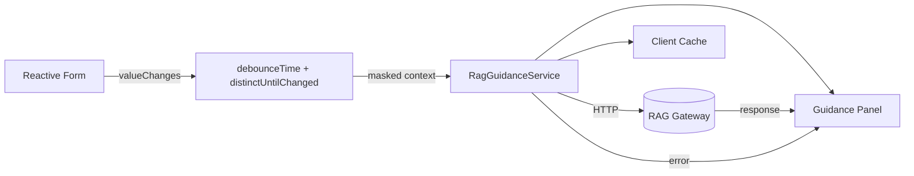

### Service: debounce + hash key + cache + cancellation

```ts
// rag-guidance.service.ts
import { Injectable } from '@angular/core';
import { HttpClient, HttpHeaders } from '@angular/common/http';
import { Observable, of, timer } from 'rxjs';
import { catchError, shareReplay } from 'rxjs/operators';

export interface RagGuidanceRequest {
  scenario: 'AddressAssist' | 'ExplainError' | 'FieldHelp';
  formContext: Record<string, any>;
  errorCode?: string;
  locale?: string;
}

export interface RagCitation {
  sourceId: string;
  title: string;
  snippet: string;
  url?: string;
}

export interface RagGuidanceResponse {
  guidanceMarkdown: string;
  citations: RagCitation[];
  correlationId: string;
}

@Injectable({ providedIn: 'root' })
export class RagGuidanceService {
  private cache = new Map<string, Observable<RagGuidanceResponse>>();

  constructor(private http: HttpClient) {}

  getGuidance(req: RagGuidanceRequest): Observable<RagGuidanceResponse> {
    const normalized = this.minimizeContext(req.formContext);
    const cacheKey = this.hashKey(req.scenario, req.errorCode, req.locale, normalized);

    const cached = this.cache.get(cacheKey);
    if (cached) return cached;

    const headers = new HttpHeaders({
      'X-Correlation-Id': crypto.randomUUID().replace(/-/g, ''),
    });

    const call$ = this.http
      .post<RagGuidanceResponse>(
        `/rag/${req.scenario === 'ExplainError' ? 'explain-error' : 'guidance'}`,
        { ...req, formContext: normalized },
        { headers }
      )
      .pipe(
        shareReplay({ bufferSize: 1, refCount: true }),
        catchError(() =>
          of({
            guidanceMarkdown:
              'Unable to load guidance right now. You can continue filling the form normally.',
            citations: [],
            correlationId: headers.get('X-Correlation-Id') || '',
          })
        )
      );

    this.cache.set(cacheKey, call$);
    timer(5 * 60 * 1000).subscribe(() => this.cache.delete(cacheKey));

    return call$;
  }

  private minimizeContext(ctx: Record<string, any>): Record<string, any> {
    const allow = [
      'countryId',
      'countryName',
      'stateId',
      'stateName',
      'city',
      'postalCode',
      'fieldInFocus',
      'missingFields',
      'formStep',
      'addressValidationResult',
      'uiErrorCode',
      'domain',
      'entityType',
    ];

    const out: Record<string, any> = {};
    for (const k of allow) {
      if (ctx[k] !== undefined && ctx[k] !== null && ctx[k] !== '') out[k] = ctx[k];
    }
    return out;
  }

  private hashKey(...parts: any[]): string {
    return btoa(unescape(encodeURIComponent(JSON.stringify(parts))));
  }
}
```

### Component pattern: side panel guidance (non-blocking)

```ts
// address-form.component.ts
import { Component, OnDestroy, OnInit } from '@angular/core';
import { FormBuilder, Validators } from '@angular/forms';
import { Subject } from 'rxjs';
import { debounceTime, distinctUntilChanged, map, takeUntil, switchMap } from 'rxjs/operators';
import { RagGuidanceService, RagGuidanceResponse } from './rag-guidance.service';

@Component({
  selector: 'app-address-form',
  templateUrl: './address-form.component.html',
})
export class AddressFormComponent implements OnInit, OnDestroy {
  private destroy$ = new Subject<void>();

  guidance?: RagGuidanceResponse;
  guidanceLoading = false;

  form = this.fb.group({
    countryId: ['', Validators.required],
    stateId: [''],
    city: [''],
    postalCode: [''],
  });

  constructor(private fb: FormBuilder, private rag: RagGuidanceService) {}

  ngOnInit(): void {
    this.form.valueChanges
      .pipe(
        debounceTime(400),
        map(v => ({
          scenario: 'AddressAssist' as const,
          formContext: {
            countryId: v.countryId,
            stateId: v.stateId,
            city: v.city,
            postalCode: v.postalCode,
            fieldInFocus: this.getFieldInFocus(),
            missingFields: this.getMissingFields(),
            formStep: 'Address',
          },
          locale: 'en-US',
        })),
        distinctUntilChanged((a, b) => JSON.stringify(a) === JSON.stringify(b)),
        takeUntil(this.destroy$),
        switchMap(req => {
          this.guidanceLoading = true;
          return this.rag.getGuidance(req);
        })
      )
      .subscribe(res => {
        this.guidance = res;
        this.guidanceLoading = false;
      });
  }

  ngOnDestroy(): void {
    this.destroy$.next();
    this.destroy$.complete();
  }

  private getMissingFields(): string[] {
    const missing: string[] = [];
    const v = this.form.value;
    if (!v.countryId) missing.push('countryId');
    return missing;
  }

  private getFieldInFocus(): string {
    return 'postalCode';
  }
}
```

Template:

```html
<!-- address-form.component.html -->
<div class="layout">
  <form [formGroup]="form" class="form">
    <!-- country/state/city/postal inputs -->
  </form>

  <aside class="assist-panel">
    <div *ngIf="guidanceLoading">Loading guidance...</div>

    <div *ngIf="!guidanceLoading && guidance">
      <div class="markdown">
        <!-- render markdown with your preferred library -->
        <pre>{{ guidance.guidanceMarkdown }}</pre>
      </div>

      <div *ngIf="guidance.citations?.length">
        <h4>References</h4>
        <ul>
          <li *ngFor="let c of guidance.citations">
            <strong>{{ c.title }}</strong>
            <div>{{ c.snippet }}</div>
          </li>
        </ul>
      </div>

      <small *ngIf="guidance.correlationId">
        Correlation: {{ guidance.correlationId }}
      </small>
    </div>
  </aside>
</div>
```

## Security and compliance guardrails

- Redact PII before retrieval and generation.
- Keep RAG credentials read-only and separated from transactional systems.
- Never persist AI output as authoritative data.
- Log prompts, sources, and outputs for auditability.
- Use rate limits and explicit user disclaimers.

## Recommended architect rules

1. RAG is not authoritative. Domain logic stays in ASP.NET Core services.
2. RAG is optional. Form UX must function if RAG is down.
3. RAG is read-only. No writes, no decisions, no validation outcomes.
4. PII is minimized. Redact or allowlist before retrieval and generation.
5. Everything is observable. Correlation IDs plus doc IDs plus prompt version.

## When RAG becomes a strategic advantage

- Rules change faster than code can be updated.
- Documentation is complex and frequently referenced.
- Users need explanations, not error codes.
- Free-text inputs are unavoidable and high value.

## TLDR

If your form logic can be expressed as code, do not use RAG. If your form logic depends on interpretation, policy, or ambiguity, RAG can add real value.
