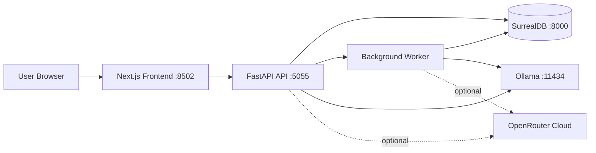
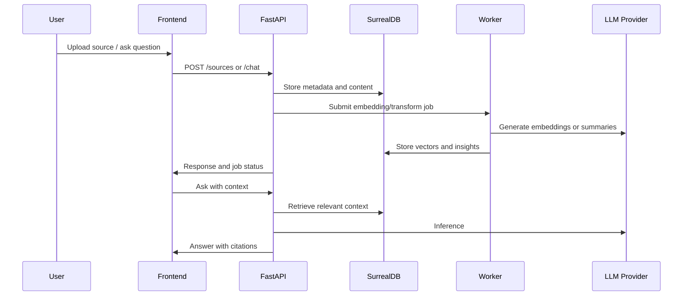
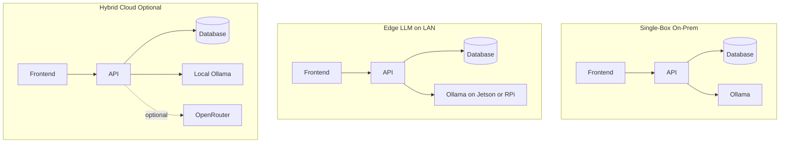
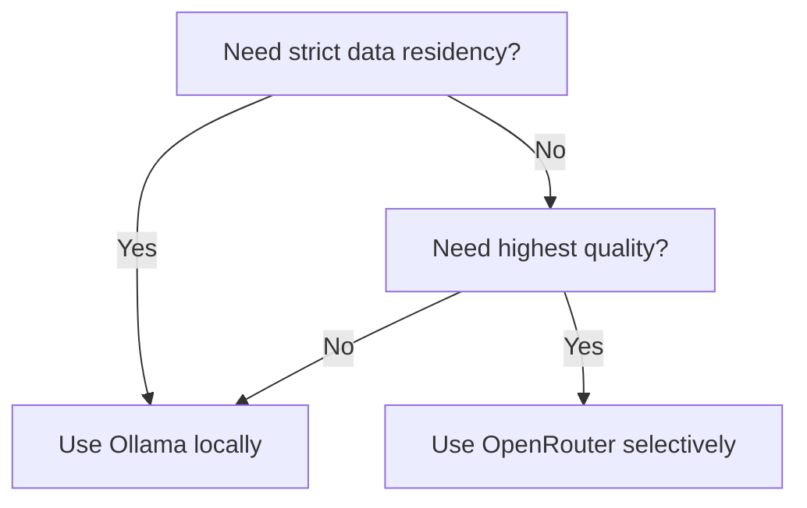

This brief explains how Open Notebook reduces AI costs and improves data compliance by keeping organizational data inside your premises. It is designed for teams evaluating on-prem or edge AI.

Open Notebook is a self-hosted, privacy-first alternative to NotebookLM. It runs a Next.js UI, FastAPI backend, SurrealDB storage, and optional local LLMs through Ollama. Cloud models are supported via OpenRouter, but they are opt-in.

<!--more-->

Source and attribution:
- Project repository: https://github.com/naveenalavilli/open-notebook
- Original codebase credit: https://github.com/lfnovo/open-notebook

---

## Overview

- **Local-first by default**: UI, API, database, and content storage run on your infrastructure.
- **Cost control**: Use local inference for zero per-token costs, or selectively use OpenRouter for burst quality.
- **Compliance alignment**: Data residency, network isolation, and internal access controls stay in your control.

---

## Design Principles

1. **Data stays on premises** unless you explicitly configure a cloud provider.
2. **Provider choice is modular** so you can swap models without vendor lock-in.
3. **Least privilege networking** keeps the system inside trusted zones.
4. **Edge-friendly deployments** allow LLMs on Jetson Nano or Raspberry Pi.

---

## System Architecture



**Key local-first behavior**:
- Notebook content, sources, notes, and embeddings are stored locally in SurrealDB.
- When Ollama is used, prompts and data never leave your infrastructure.
- OpenRouter usage is explicit and can be disabled by policy.

---

## Core Data Flow



---

## Deployment Topologies



**When to use each**:
- **Single-box on-prem** for strict compliance or air-gapped networks.
- **Edge LLM on LAN** when you want AI on Jetson/Raspberry Pi while keeping storage centralized.
- **Hybrid** when you need high-quality cloud models for specific tasks.

---

## Compliance and Security Controls

Open Notebook supports a compliance-first posture, but enforcement is defined by your infrastructure.

**Controls to apply**:
- Keep data on internal disks: `./notebook_data`, `./surreal_data`.
- Limit egress with firewall rules; allow only internal service communication.
- Use internal TLS termination and reverse proxy controls.
- Enable password protection via `OPEN_NOTEBOOK_PASSWORD`.
- Use local LLMs (Ollama) for restricted data.
- Define backup and retention policies for SurrealDB volumes.

**Related documentation**:
- `docs/5-CONFIGURATION/security.md`
- `docs/5-CONFIGURATION/ollama.md`

---

## Cost Model and Optimization

Open Notebook cost is controlled by where inference runs and how models are selected.

| Cost Driver | Local-First Impact | Optimization Lever |
| --- | --- | --- |
| LLM usage | No per-token fees with Ollama | Use smaller models for daily tasks |
| Cloud inference | Variable cost via OpenRouter | Route only high-value tasks to cloud |
| Storage | Local disks only | Purge or archive older sources |
| Compute | CPU/GPU utilization | Batch embeddings and reuse vectors |

**Decision guide**:


---

## Hardware Guidance for Edge Deployments

**PC/Server**:
- Best overall performance.
- Run full stack with local Ollama and larger models.

**Raspberry Pi**:
- Use a 64-bit OS and Docker.
- Host Open Notebook, but prefer smaller models or offload inference to another device.

**Jetson Nano (or Jetson Nano Super)**:
- Good for local inference and edge deployments.
- Run Ollama on the Jetson and expose it on the LAN:
  - `OLLAMA_HOST=0.0.0.0:11434`
  - Validate with `curl http://<jetson-ip>:11434/api/tags`

---

## Configuration Quick Reference

**Local-first with Ollama**:
```bash
OLLAMA_API_BASE="http://<ollama-host-ip>:11434"
```

**Cloud option with OpenRouter**:
```bash
OPENROUTER_BASE_URL="https://openrouter.ai/api/v1"
OPENROUTER_API_KEY=sk-or-...
```

Choose one or combine both. Local-first keeps data on premises; OpenRouter adds optional cloud capacity.

---

## Operational Considerations

- **Backups**: Snapshot `./surreal_data` and `./notebook_data` to internal storage.
- **Monitoring**: Track API latency, worker queues, and storage growth.
- **Model governance**: Limit allowed models for regulated workloads.
- **Upgrade strategy**: Use Docker tags and versioned releases for controlled rollout.

---

## Implementation Checklist

1. Choose deployment topology (single-box, edge LAN, or hybrid).
2. Select model strategy (Ollama local, OpenRouter cloud, or both).
3. Configure network zones and egress controls.
4. Configure `docker.env` and start the stack.
5. Define backups and data retention policies.
6. Validate with non-sensitive data before production use.

---

## Summary

Open Notebook provides a pragmatic local-first AI platform that reduces AI costs and strengthens data compliance by keeping organizational data on premises. With optional OpenRouter support, architects can selectively balance cost, quality, and compliance while retaining full control of infrastructure and data residency.
