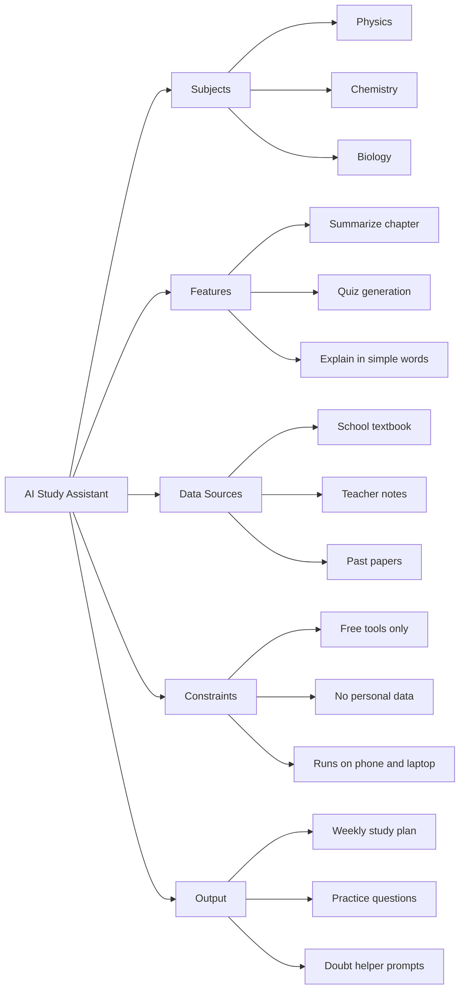
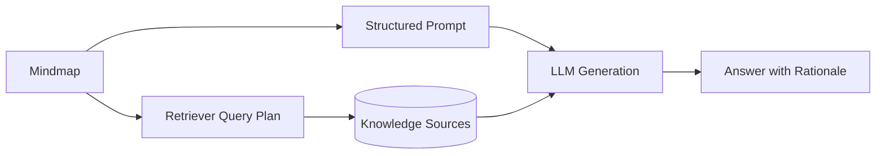

Mindmaps are one of the easiest ways to think clearly with AI. If you are a
student, teacher, developer, or researcher, mindmaps help you turn a messy
idea into a clean structure. Once the structure is clear, AI gives better
answers, better plans, and better summaries.

<!--more-->


## Why Mindmaps Work Well with AI

AI models are strong at pattern matching, but they still need clean context.
A mindmap gives that context in a natural way.

- **Break down complexity**: Big topics become small, manageable pieces.
- **Show relationships**: You can see what connects to what.
- **Reduce vague prompts**: Branches force you to be specific.
- **Improve memory**: Visual structure helps you remember faster.
- **Support teamwork**: Everyone can see the same picture.

In short: better structure in means better AI output out.

## Mindmap Basics (In Plain Language)

Think of a mindmap like a tree:

- The **trunk** is your main topic.
- The **big branches** are major parts of that topic.
- The **small branches** are details, examples, and tasks.

Example:

- Main topic: "How to prepare for board exams"
- Branches: subjects, timetable, revision strategy, weak areas, mock tests
- Sub-branches: math formulas, biology diagrams, weekend test plan

That is all a mindmap is: one idea, then organized layers of related ideas.

## Why This Matters in AI Projects

Most AI mistakes happen because the prompt is unclear, too broad, or missing
context. Mindmaps solve all three problems.

Without a map, a prompt might be:

"Help me build an AI app."

With a map, the prompt becomes:

"Help me build a homework assistant for grade 10 science. Constraints: 2-week
timeline, free tools only, no student personal data. Outputs needed: UI wireframe,
prompt templates, and test cases."

The second prompt is much more likely to get useful output.

## Real Student-Friendly Example

Let us build a sample mindmap for this project:

**Goal**: Build an AI study assistant for high school science.



You can now turn each branch into prompts, tasks, and files.

## Free and Popular Mindmap Tools

These are widely used and have free options:

1. **diagrams.net (draw.io)**
	- Completely free and web-based.
	- Great for beginners.
	- Easy export to PNG/SVG/PDF.
2. **XMind (Free Plan)**
	- Excellent mindmap-focused interface.
	- Fast keyboard-based mapping.
	- Good templates.
3. **Coggle (Free Tier)**
	- Very simple collaborative mindmaps.
	- Great for group projects.
4. **Miro (Free Tier)**
	- Flexible whiteboard with mindmap capability.
	- Useful for class teams and workshops.
5. **Excalidraw (Free)**
	- Hand-drawn style.
	- Very fast for brainstorming sessions.

If you want one recommendation to start today: use **diagrams.net**.

## Step-by-Step: Implement a Sample Mindmap with diagrams.net

### Step 1: Open the tool

- Go to diagrams.net.
- Choose local storage or cloud storage.
- Create a blank diagram.

### Step 2: Add your central topic

- Add one central shape in the middle.
- Name it: "AI Study Assistant".

### Step 3: Add first-level branches

Create five branches from the center:

- Subjects
- Features
- Data Sources
- Constraints
- Output

Tip: Keep first-level branches between 4 and 7. Too many branches make the map
hard to read.

### Step 4: Add second-level details

Expand each branch with concrete items.

Example:

- Features -> summarize chapter, generate quiz, explain difficult concepts
- Constraints -> free tools, low internet, no personal data

### Step 5: Add labels or colors

- Use one color for "must-have" items.
- Use another color for "nice-to-have" items.
- Add icons for high-priority tasks.

This helps both humans and AI understand importance.

### Step 6: Convert map nodes into prompts

Turn each branch into a prompt block.

Prompt template:

```text
You are helping me build [project name].

Goal:
- [main goal from center node]

Scope:
- [branch 1 details]
- [branch 2 details]

Constraints:
- [cost, privacy, device limits]

Deliverables:
- [expected outputs]

Now propose a step-by-step plan with timeline and risks.
```

### Step 7: Run and improve

- Ask AI for output.
- Compare output against your map.
- If output is weak, improve branch clarity.
- Repeat.

This loop is simple:

$$
	ext{Better map} \Rightarrow \text{better prompt} \Rightarrow \text{better output}
$$

## A Complete Mini-Workflow You Can Follow in 30 Minutes

1. Pick one topic (example: "Learn AI basics in 4 weeks").
2. Build a mindmap with 5 main branches.
3. Add 3 to 5 sub-branches under each.
4. Copy map content into the prompt template.
5. Ask AI for a weekly plan.
6. Validate plan with teacher, mentor, or rubric.
7. Update map and rerun.

By the end, you will have a clear map, a useful plan, and a repeatable method.

## Practical AI Workflows Using Mindmaps

1. **Planning and discovery**: Start from one question, then branch into
	assumptions, constraints, risks, and data sources.
2. **Prompt design**: Convert each branch into a focused prompt section.
3. **RAG preparation**: Define document clusters before chunking and indexing.
4. **Decision support**: Compare options by cost, risk, and expected impact.
5. **Exam prep**: Organize topics, weak areas, and revision prompts.
6. **Project execution**: Track tasks, blockers, and dependencies visually.

## Prompt Examples from the Same Mindmap

### Example 1: Planning prompt

```text
Act as an AI study coach. Build a 4-week science plan for a grade 10 student.
Subjects: Physics, Chemistry, Biology.
Constraints: 1 hour per weekday, 2 hours per weekend day, free resources only.
Output: weekly schedule, chapter priorities, revision strategy.
```

### Example 2: Quiz prompt

```text
Generate a mixed quiz from Physics and Chemistry.
Difficulty: medium.
Format: 10 MCQs + 5 short answers.
Include answer key and one-line explanation per question.
```

### Example 3: Doubt-solving prompt

```text
Explain this concept in very simple language for a high school student.
Use one real-life example and one memory trick.
Concept: Chemical bonding.
```

## Common Mistakes and Fixes

- **Mistake**: Branch names are too generic (example: "stuff", "other").
  **Fix**: Use specific labels (example: "Physics chapters", "Exam constraints").
- **Mistake**: No priorities in the map.
  **Fix**: Mark branches as high/medium/low priority.
- **Mistake**: Map is never updated.
  **Fix**: Review and refine weekly.
- **Mistake**: AI prompt ignores constraints.
  **Fix**: Always include constraints as a dedicated prompt section.

## Mindmap-to-Prompt Pattern

A practical pattern that works across projects:

1. Define the root topic.
2. Add first-level branches: goals, constraints, stakeholders, data.
3. Expand each branch with concrete facts and evidence links.
4. Turn each branch into a prompt section.
5. Ask the model to reason branch-by-branch before final synthesis.

This improves traceability and makes review easier when decisions are
high-impact.

## How to Use Mindmaps for RAG (Simple Version)

If you are building a Retrieval-Augmented Generation system:

- Use branches as document categories.
- Use sub-branches as query intents.
- Use branch labels as metadata tags.

Example:

- Branch: "Biology"
- Sub-branch: "Cell division"
- Tag in vector store: `subject=biology, topic=cell-division`

This makes retrieval cleaner and answers more relevant.

## Reference Flow

Mindmaps are most useful when they are shared across planning, retrieval, and
generation instead of living as a standalone visual.



## Where This Helps Most

- Product strategy and feature decomposition.
- Research synthesis and literature reviews.
- Technical architecture decisions.
- Incident analysis and postmortems.
- Learning plans for fast-moving domains.
- Classroom teaching and exam preparation.
- Group projects with shared ownership.

## If We Do Not Use Mindmaps, What Are the Alternatives?

Mindmaps are great, but they are not the only option. Choose based on the
problem.

1. **Linear Outlines (bulleted notes)**
	- Best when topic is simple and sequential.
	- Weak for showing relationships across sections.
2. **Kanban Boards (To Do / Doing / Done)**
	- Best for execution tracking.
	- Weak for concept relationships.
3. **Spreadsheets**
	- Best for structured comparison and scoring.
	- Weak for brainstorming and idea expansion.
4. **Concept Maps**
	- Similar to mindmaps but with labeled relationship arrows.
	- Better for deep academic reasoning.
5. **Flowcharts**
	- Best for process and decision flows.
	- Weak for open-ended brainstorming.
6. **Cornell Notes / Two-column Notes**
	- Best for lecture learning and revision.
	- Weak for multi-directional topic exploration.

### Quick Decision Guide

- Need brainstorming and idea expansion: choose mindmaps.
- Need task tracking: choose Kanban.
- Need process clarity: choose flowcharts.
- Need ranking/comparison: choose spreadsheet.
- Need deep concept relationships: choose concept maps.

## Common Pitfalls

- **Over-branching early**: Too many nodes before clarity creates noise.
- **Vague node labels**: Ambiguous labels reduce prompt quality.
- **No evidence links**: Claims without references weaken reliability.
- **Static maps**: Mindmaps should evolve as data changes.

## Ready-to-Use Starter Template

Copy and fill this template in any tool:

```text
Center Topic:
- [Your project or learning goal]

Branch 1: Goal
- [What success looks like]

Branch 2: Scope
- [What is included]
- [What is excluded]

Branch 3: Inputs
- [Books, notes, docs, links]

Branch 4: Constraints
- [Time]
- [Budget]
- [Privacy/rules]

Branch 5: Deliverables
- [Plan, report, prototype, presentation]
```


Mindmaps are not just a visualization aid. In AI workflows, they act as a
reasoning interface that improves prompt quality, transparency, and decision
speed. If model outputs feel scattered, improve the map before tuning the
model.