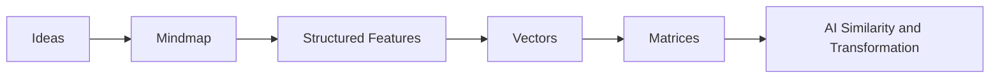

If mindmaps help humans organize ideas, vectors help machines organize meaning.
This post explains vectors, matrices, and similarity in plain language for high
school students, college learners, engineers, and professionals who want to
understand the math behind modern AI without getting lost in heavy notation.

The code examples use both Python and C# so the same ideas are easier to map to
data-science workflows and .NET application design.

<!--more-->

## Why This Topic Matters

Most AI systems work with numbers. Text, images, audio, user profiles, and many
other inputs are eventually turned into lists and tables of numbers.

That is where vectors and matrices come in:

- A **vector** is a list of numbers.
- A **matrix** is a table of numbers.

That sounds too simple, but that simplicity is exactly why these ideas matter.
AI uses vectors to represent one thing, and matrices to represent many things at
once.

## A Plain-Language Definition of a Vector

A vector is an ordered list of values.

Example:

```text
[5, 10]
```

This could mean:

- A location on a map: `x=5, y=10`
- A game position on a screen
- A student's score in two subjects

The meaning comes from the labels, not from the numbers alone.

For example:

```text
[92, 88, 95]
```

This could mean:

- Math = 92
- Physics = 88
- Chemistry = 95

So a vector is not just "numbers in brackets." It is a compact way to describe
something.

## Daily-Life Examples of Vectors

Vectors show up in normal life more often than people realize.

### 1. Location on a map

If a school is at `(4, 7)` and a home is at `(1, 2)`, both are vectors.

```text
School = [4, 7]
Home   = [1, 2]
```

### 2. Student profile

A student can be represented as:

```text
[math_interest, reading_interest, coding_interest]
```

Example:

```text
[9, 6, 10]
```

This tells us something about the student's interests in a structured way.

### 3. Streaming recommendations

A movie or song can also be represented with features:

```text
[action, comedy, emotion, pace]
```

Then the system compares a preference vector with the movie vector.

### 4. Health or device sensors

A smartwatch reading can be represented as:

```text
[heart_rate, steps, sleep_hours]
```

AI systems compare such vectors over time to detect trends or anomalies.

## Why Vectors Matter in AI

AI often needs to answer questions like these:

- Which item is most similar to this one?
- Which candidate matches this user best?
- Which example is closest to this pattern?
- Which pattern looks unusual?

Vectors make those questions measurable.

What counts as "close" depends on the comparison method. Some methods use
distance, while cosine similarity focuses on how aligned two vectors are.

This is the basic idea behind recommendations, clustering, ranking, and pattern
analysis.

## Similarity: The Most Important Idea

Suppose we represent a student's interests like this:

```text
Student A = [8, 2, 9]
AI Club   = [9, 1, 10]
Music Club= [2, 9, 3]
```

By inspection, Student A looks closer to the AI Club than to the Music Club.
AI systems do this comparison mathematically.

One popular method is **cosine similarity**. In plain language, it checks how
aligned two vectors are. It cares more about direction than raw size.

## Python Example: Comparing Two Vectors

This example uses a student-interest analogy because the same logic later
appears in recommendations, ranking, and matching systems.

```python
from math import sqrt

def dot(a, b):
    return sum(x * y for x, y in zip(a, b))

def norm(v):
    return sqrt(sum(x * x for x in v))

def cosine_similarity(a, b):
    return dot(a, b) / (norm(a) * norm(b))

student = [8, 2, 9]      # math, music, coding
ai_club = [9, 1, 10]
music_club = [2, 9, 3]

print("AI club match:", round(cosine_similarity(student, ai_club), 3))
print("Music club match:", round(cosine_similarity(student, music_club), 3))
```

The AI Club score should be higher because its feature pattern is more aligned
with the student's interests.

What this shows:

- A vector can describe a person, object, or record.
- Similarity can be computed with code.
- AI can rank options based on that similarity.

This is already enough intuition to understand how many recommendation and
ranking systems begin.

## C# Example: Comparing Two Vectors

In .NET, the same logic looks like this:

```csharp
using System;

static double Dot(double[] a, double[] b)
{
    double sum = 0;

    for (int i = 0; i < a.Length; i++)
    {
        sum += a[i] * b[i];
    }

    return sum;
}

static double Norm(double[] v)
{
    return Math.Sqrt(Dot(v, v));
}

static double CosineSimilarity(double[] a, double[] b)
{
    return Dot(a, b) / (Norm(a) * Norm(b));
}

var student = new double[] { 8, 2, 9 };
var aiClub = new double[] { 9, 1, 10 };
var musicClub = new double[] { 2, 9, 3 };

Console.WriteLine($"AI club match: {CosineSimilarity(student, aiClub):0.000}");
Console.WriteLine($"Music club match: {CosineSimilarity(student, musicClub):0.000}");
```

The structure is the same:

- A `double[]` is the vector.
- The dot product measures feature interaction.
- Cosine similarity turns that into a comparable score.

## What Is a Matrix?

If a vector represents one item, a matrix represents many items together.

Example:

```text
[
  [92, 88, 95],
  [75, 91, 84],
  [89, 79, 90]
]
```

This matrix could represent marks for three students across three subjects.

Think of it like a spreadsheet:

- Each **row** is one item.
- Each **column** is one feature.

That is a very useful mental model for AI.

## Daily-Life Examples of Matrices

### 1. School marks table

Each row is a student. Each column is a subject.

### 2. Company sales sheet

Each row is a store. Each column is a month.

### 3. Image pixels

A grayscale image can be represented as a matrix where each number tells how
bright or dark a pixel is.

### 4. Business or research data

If each record becomes a vector, then all records together form a matrix. This
is useful in analytics, scoring, and machine learning systems.

## Why Matrices Matter in AI

AI rarely works on one item at a time in isolation. It usually works on many
items together:

- Many students
- Many customers
- Many documents
- Many images
- Many words or tokens

Matrices let AI process all of them efficiently.

This is also where matrix multiplication becomes important.

## Matrix Multiplication in Plain Language

Matrix multiplication sounds difficult, but the core idea is simple:

- Some inputs are taken.
- Weights are applied.
- A new set of values is produced.

That is exactly what many AI models do again and again.

In a neural network, an input vector is multiplied by a weight matrix to create
a new representation. That new representation may then go through more layers.

Real models usually add other steps too, such as bias terms and activation
functions, but matrix multiplication is still one of the core operations.

Advanced math is not required to understand the big picture:

```text
input vector -> weight matrix -> transformed output
```

## Python Example: Weighted Scores with a Matrix

This is not "deep learning," but it uses the same structural idea.

If NumPy is not already installed:

```bash
pip install numpy
```

```python
import numpy as np

# Rows = students, columns = math, science, project
scores = np.array([
    [92, 88, 95],
    [75, 91, 84],
    [89, 79, 90]
])

# Weight of each component
weights = np.array([0.4, 0.3, 0.3])

final_scores = scores @ weights

print(final_scores)
```

Why this matters:

- `scores` is a matrix.
- `weights` is a vector.
- `scores @ weights` combines several features into one result.

This same pattern appears in machine learning. The only difference is that real
AI models use much larger vectors, much larger matrices, and learned weights.

## C# Example: Weighted Scores with a Matrix

In C#, the same idea can be modeled with a `double[,]` matrix and a `double[]`
weight vector:

```csharp
using System;

static double[] Multiply(double[,] matrix, double[] vector)
{
    int rows = matrix.GetLength(0);
    int cols = matrix.GetLength(1);

    if (cols != vector.Length)
    {
        throw new ArgumentException("Matrix columns must match vector length.");
    }

    var result = new double[rows];

    for (int row = 0; row < rows; row++)
    {
        double sum = 0;

        for (int col = 0; col < cols; col++)
        {
            sum += matrix[row, col] * vector[col];
        }

        result[row] = sum;
    }

    return result;
}

var scores = new double[,]
{
    { 92, 88, 95 },
    { 75, 91, 84 },
    { 89, 79, 90 }
};

var weights = new double[] { 0.4, 0.3, 0.3 };
var finalScores = Multiply(scores, weights);

for (int i = 0; i < finalScores.Length; i++)
{
    Console.WriteLine($"Student {i + 1} final score: {finalScores[i]:0.0}");
}
```

For architects, this is the practical bridge:

- One row can represent one record, user, or document.
- One column can represent one feature.
- A matrix-vector multiplication step combines many inputs into one derived score.

## A Very Simple AI Mental Model

Many AI systems can be understood like this:

1. Convert the input into numbers.
2. Store those numbers in vectors.
3. Group many vectors into matrices.
4. Compare or transform them with math.
5. Produce a prediction, ranking, or response.

That is not the full story, but it is a very good starting point.

## Why This Matters for Students and Professionals

For students:

- It explains why AI is not magic.
- It gives a practical reason to care about basic algebra.
- It helps shift thinking from prompts to systems.

For professionals:

- It explains how AI systems represent data mathematically.
- It makes recommendation and ranking systems easier to reason about.
- It reduces confusion around terms like similarity, features, weights, and
  transformations.

## From Mindmaps to Machine Representation

In the previous post, [Mindmaps in AI](https://alavillinaveen.github.io/ai/thinking/2026/03/29/mindmaps-in-ai.html),
the focus was on structuring ideas so humans and AI systems can work with them
more clearly.

This post moves one level deeper. Once an idea is structured, a machine still
needs a numerical form to compare, rank, search, or transform it. That is where
vectors and matrices come in.

The connection is simple:

- Mindmaps organize ideas into branches.
- Vectors organize features into numeric form.
- Matrices organize many vectors into one usable structure.

So the journey is natural:



Vectors and matrices are not extra decoration around AI. They are part of the
basic language machines use to represent, compare, and transform information.
Once these ideas are clear, many AI systems become easier to explain and
evaluate.
