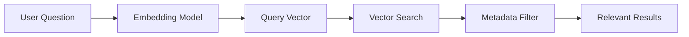

In [Vectors and Matrices in AI](),
the focus was on how AI systems represent information numerically. That
foundation leads to the next practical question: once text, images, or records
can be represented as vectors, how does a system search, compare, and retrieve
them at scale?

Embeddings and vector databases answer that question. They take the mathematical
ideas behind vectors and similarity and turn them into a practical retrieval
system for meaning-based search.

This article is written in plain language for high school learners, engineers,
architects, and professionals who want to understand how semantic search works
in real systems.

The code examples use SQL, Python, and C# so the same ideas can be connected to
data workflows and .NET application design.

<!--more-->

## Why This Topic Matters

A normal database is very good at exact matching:

- Find employee `1042`
- Find invoices from `March`
- Find all rows where `country = 'US'`

But AI systems often need something different:

- Find notes related to "paid leave" even if the document says "vacation policy"
- Find biology content similar to "plant energy conversion"
- Find support articles related to an error message even when wording changes

That is where embeddings and vector databases become useful.

## What an Embedding Is

An embedding is a vector created by a model to represent meaning.

A sentence, paragraph, image, or product description can be converted into a
list of numbers. If two pieces of content have similar meaning, their vectors
often end up close to each other.

Example idea:

```text
"How many vacation days do employees get?"
"What is the annual paid leave policy?"
```

These sentences use different words, but their meaning is similar. A good
embedding model can place them near each other in vector space.

## Daily-Life Examples of Embeddings

### 1. School notes search

A student searches for:

```text
"How do plants make food?"
```

The stored note might say:

```text
"Photosynthesis converts sunlight into chemical energy."
```

Keyword search may miss this. Embeddings can connect the meaning.

### 2. Company policy assistant

An employee asks:

```text
"How much vacation time is allowed?"
```

The actual HR policy may use the phrase "paid leave" instead of "vacation
time." Embeddings help retrieve the correct policy text.

### 3. Product search

A shopper looks for:

```text
"lightweight running shoes for rainy weather"
```

The product title may not use those exact words, but semantic similarity can
still bring the right items forward.

### 4. Support knowledge base

A user pastes an error description in free text. The system retrieves the most
similar troubleshooting articles, even when the wording is not identical.

## Why Keyword Search Is Not Enough

Keyword search is still useful, but it has limits:

- It depends heavily on exact word overlap.
- It struggles with paraphrases.
- It struggles with synonyms.
- It struggles when the query is phrased differently from the source text.

Embeddings do not replace all search methods, but they make meaning-based
retrieval possible.

## What a Vector Database Actually Does

A vector database stores vectors and retrieves the nearest matches.

In practice, each stored record usually has:

- The original text or content
- The embedding vector
- Metadata such as source, category, date, or owner

When a query comes in:

1. The query is converted into an embedding.
2. The database searches for nearby vectors.
3. Metadata filters narrow the results when needed.
4. The application returns the most relevant content.

## A Simple Mental Model

The process can be seen as:



For .NET teams, this often becomes:

```text
ASP.NET Core API -> Embedding Service -> Vector Search -> Retrieved Context -> Response
```

## A Small Example Dataset

Real embeddings often contain hundreds or thousands of dimensions. The examples
below use only 3 dimensions so the structure is easy to read.

```text
HR policy         -> [0.92, 0.11, 0.83]
Biology note      -> [0.15, 0.94, 0.21]
Physics note      -> [0.33, 0.88, 0.52]
HR query          -> [0.91, 0.10, 0.82]
```

The HR query vector should be closest to the HR policy vector.

## SQL Example: PostgreSQL with pgvector

This example uses PostgreSQL with the `pgvector` extension.

```sql
CREATE EXTENSION IF NOT EXISTS vector;

CREATE TABLE knowledge_chunks (
    id bigserial PRIMARY KEY,
    category text NOT NULL,
    source text NOT NULL,
    content text NOT NULL,
    embedding vector(3) NOT NULL
);

INSERT INTO knowledge_chunks (category, source, content, embedding) VALUES
('hr', 'leave-policy', 'Employees receive 20 paid vacation days per year.', '[0.92,0.11,0.83]'),
('science', 'biology-notes', 'Photosynthesis converts sunlight into chemical energy.', '[0.15,0.94,0.21]'),
('physics', 'mechanics-notes', 'Force equals mass times acceleration.', '[0.33,0.88,0.52]');
```

To retrieve the nearest HR-related content:

```sql
SELECT
    id,
    category,
    source,
    content,
    1 - (embedding <=> '[0.91,0.10,0.82]') AS cosine_similarity
FROM knowledge_chunks
WHERE category = 'hr'
ORDER BY embedding <=> '[0.91,0.10,0.82]'
LIMIT 3;
```

What this query does:

- `embedding <=> query_vector` computes cosine distance.
- `ORDER BY` returns the nearest matches first.
- `WHERE category = 'hr'` keeps the search inside the correct domain.
- `1 - cosine distance` gives a readable similarity score.

## C# Example: Query Similar Content from PostgreSQL

In C#, the same retrieval flow can be implemented with `Npgsql`.

```csharp
using System;
using Npgsql;

var queryEmbedding = "[0.91,0.10,0.82]";

await using var connection = new NpgsqlConnection(
    "Host=localhost;Username=postgres;Password=postgres;Database=ai_demo");

await connection.OpenAsync();

const string sql = """
SELECT
    content,
    1 - (embedding <=> CAST(@embedding AS vector)) AS cosine_similarity
FROM knowledge_chunks
WHERE category = @category
ORDER BY embedding <=> CAST(@embedding AS vector)
LIMIT 3;
""";

await using var command = new NpgsqlCommand(sql, connection);
command.Parameters.AddWithValue("embedding", queryEmbedding);
command.Parameters.AddWithValue("category", "hr");

await using var reader = await command.ExecuteReaderAsync();

while (await reader.ReadAsync())
{
    var content = reader.GetString(0);
    var score = reader.GetDouble(1);

    Console.WriteLine($"{score:0.000} {content}");
}
```

This is the application-level pattern:

- Generate an embedding for the incoming query.
- Send that vector to the database.
- Apply metadata filters.
- Return the closest content.

## Python Example: Query Similar Content from PostgreSQL

The same idea in Python looks like this:

```python
import psycopg

query_embedding = "[0.91,0.10,0.82]"

with psycopg.connect(
    "dbname=ai_demo user=postgres password=postgres host=localhost"
) as conn:
    with conn.cursor() as cur:
        cur.execute(
            """
            SELECT
                content,
                1 - (embedding <=> %s::vector) AS cosine_similarity
            FROM knowledge_chunks
            WHERE category = %s
            ORDER BY embedding <=> %s::vector
            LIMIT 3
            """,
            (query_embedding, "hr", query_embedding),
        )

        for content, score in cur.fetchall():
            print(round(score, 3), content)
```

The important idea is not the language. The important idea is that the same
vector search pattern works across application stacks.

## Why Metadata Still Matters

Vector similarity alone is not enough for production systems.

Metadata matters because it helps answer questions like:

- Search only HR content
- Search only documents from 2026
- Search only content owned by one team
- Search only public knowledge, not private notes

Good retrieval systems combine:

- Similarity search for meaning
- Metadata filters for control
- Ranking logic for relevance

## Common Mistakes and Fixes

- **Mistake**: Storing vectors without the original text.
  **Fix**: Always keep the source content and identifiers with the embedding.
- **Mistake**: Mixing embeddings from different models in the same field.
  **Fix**: Use one embedding model per indexed collection unless migration is carefully managed.
- **Mistake**: Using only vector similarity when exact filters are required.
  **Fix**: Keep metadata and structured filters in the design.
- **Mistake**: Assuming vector search understands everything.
  **Fix**: Retrieval improves relevance, but it does not guarantee correctness.
- **Mistake**: Using toy examples as if they reflect production scale.
  **Fix**: Real systems need evaluation, indexing strategy, latency checks, and governance.

## Where This Helps Most

- Study-note search for students
- Enterprise policy assistants
- Internal knowledge retrieval
- Support article matching
- Product discovery
- Resume and job matching

## Ready-to-Remember Summary

- An embedding is a vector that represents meaning.
- A vector database retrieves nearby vectors instead of exact keyword matches.
- Semantic search helps connect similar meaning across different wording.
- Metadata is still necessary for filtering, safety, and control.
- The same retrieval pattern works in SQL, Python, and C#.

Embeddings and vector databases are not separate from the math of AI. They are
practical systems built on top of vectors, similarity, and structured data.
