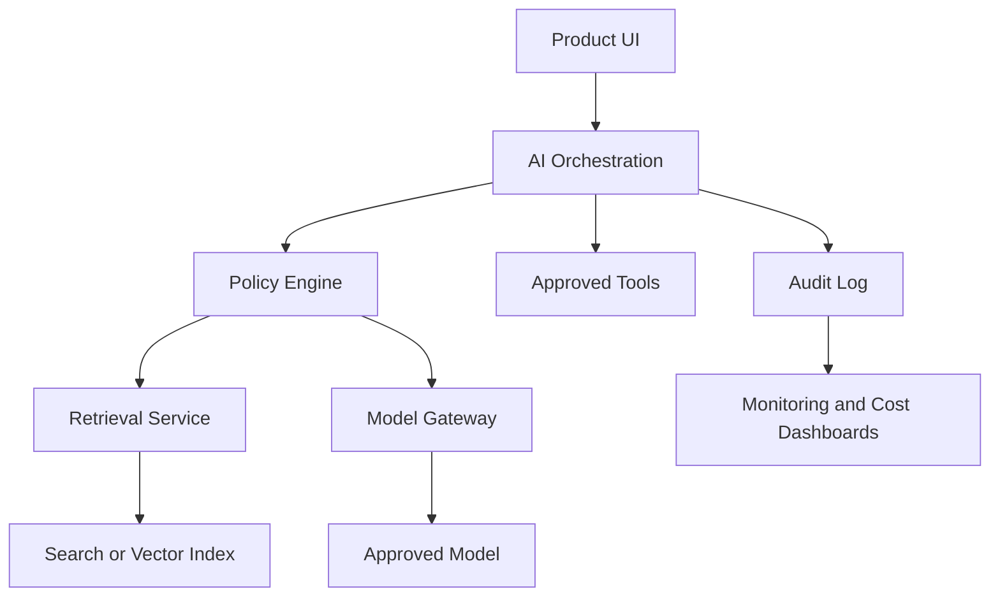

AI transformation is often discussed as if it starts with choosing a model or
building a chatbot. In real organizations, that is rarely where the hard work
begins.

The harder problem is moving from AI ambition to reliable delivery: deciding
which use cases matter, understanding data and compliance constraints,
designing secure architecture, measuring quality, controlling cost, and
operating AI systems after launch.

I created
[AI-TransformationProcesses](https://github.com/naveenalavilli/AI-TransformationProcesses)
as a practical playbook for that work.

<!--more-->

The repository is designed for teams that need to AI-enable existing products,
legacy platforms, internal enterprise systems, SaaS products, or regulated
workflows across on-premises, private cloud, hybrid, and public cloud
environments.

## Why This Project Exists

Many AI programs fail because they treat AI as a feature experiment instead of
a product, architecture, and operating model change.

Common symptoms include:

- Use cases selected because they sound impressive, not because they create
  measurable value.
- Pilots that work in demos but cannot survive production controls.
- Security, privacy, and compliance reviews that happen too late.
- No clear evaluation strategy for quality, hallucination risk, or cost.
- Teams solving the same model access, logging, prompt, retrieval, and
  monitoring problems independently.
- No repeatable path from pilot to production.

The playbook is meant to make those gaps visible early.

## The Core Idea

AI enablement should move through a governed lifecycle:

Each phase has a specific purpose.

| Phase | Main Question | Typical Output |
| --- | --- | --- |
| Mobilize | Who owns the AI program and what guardrails apply? | Charter, sponsors, governance model |
| Discover | Which use cases are worth pursuing? | Use case catalog, value/risk map |
| Assess | Is the product, data, team, and control environment ready? | Readiness assessment |
| Design | What architecture, policies, and evaluation gates are required? | Solution design, controls, cost model |
| Pilot | Does the use case prove value safely? | MVP, evaluation results, go/no-go decision |
| Industrialize | Can it run in production reliably? | Monitoring, runbooks, compliance evidence |
| Scale | How do teams repeat this without reinventing everything? | Shared platform, standards, metrics |

This sequence is not meant to be rigid. Some organizations will loop back,
pause, or split work by risk tier. But the order matters because skipped
decisions usually return later as production problems.

## What Is Inside the Repository

The repository is organized as a documentation-first operating guide. It
includes:

- An executive overview for leadership alignment.
- A phased AI enablement roadmap.
- A use case catalog for identifying AI opportunities.
- Product and portfolio assessment guidance.
- Architecture reference patterns for cloud, private cloud, hybrid, on-premises,
  and legacy integration scenarios.
- Data readiness and governance guidance.
- Security, privacy, compliance, and responsible AI policy guidance.
- Delivery model and team structure recommendations.
- Cost, funding, and FinOps considerations.
- Implementation patterns for RAG, copilots, agentic workflows, predictive AI,
  and automation.
- Testing, evaluation, and production quality gates.
- Operations, monitoring, incident response, adoption, and change management
  guidance.
- Reusable templates and checklists.

That last part is important. Transformation work becomes real when teams can
fill out the same templates, compare decisions consistently, and keep evidence
for future reviews.

## Architecture Is a First-Class Concern

AI architecture is not just a model endpoint behind an API. A production-ready
AI capability usually needs several cooperating parts:

The playbook encourages teams to separate product UI, orchestration, retrieval,
model access, policy enforcement, audit logging, and monitoring. That separation
makes the system easier to secure, test, observe, and change.

Minimum production controls include:

- Approved model access paths.
- Authentication and authorization at every layer.
- Data classification enforcement in retrieval.
- Prompt, model, policy, and retrieval index versioning.
- Evaluation pipelines.
- Audit logging.
- Monitoring and alerting for latency, errors, quality, cost, and incidents.
- Tested fallback behavior.
- Incident runbooks.

These controls are not overhead. They are what let AI features survive real
users, real data, and real support expectations.

## A Practical Way to Use It

For a new AI program, start with these documents:

1. Executive overview.
2. AI enablement roadmap.
3. Use case catalog.
4. Product and portfolio assessment.
5. Architecture reference guide.
6. Security, privacy, and compliance guidance.
7. Templates and checklists.

For a single product team, start smaller:

1. Fill out the use case intake template.
2. Complete the product readiness assessment.
3. Identify the AI pattern: RAG, copilot, classification, automation,
   recommendation, agentic workflow, or predictive ML.
4. Draft the architecture and data flow.
5. Define evaluation metrics before building.
6. Estimate cost at realistic usage levels.
7. Use the production readiness checklist before launch.

This makes the first pilot more disciplined without turning it into a large
transformation program.

## Why Templates Matter

The repository includes templates for:

- AI transformation charter.
- Use case intake.
- Product readiness assessment.
- Risk and compliance review.
- Production readiness checklist.
- AI incident runbook.
- Architecture decision record.
- AI cost model.
- Vendor evaluation.
- Security threat model.

These templates help teams ask better questions earlier:

- What business outcome are we trying to improve?
- What data is involved, and who is allowed to access it?
- What happens when the model is wrong?
- How will we measure quality?
- What is the fallback path?
- What does this cost per user, task, transaction, and environment?
- Who approves launch?

If a team cannot answer those questions, it is not ready for production.

AI transformation is not a single project. It is a repeatable capability that
connects product strategy, engineering discipline, security controls, data
governance, operating practices, and measurable business outcomes.

The goal of
[AI-TransformationProcesses](https://github.com/naveenalavilli/AI-TransformationProcesses)
is to give teams a clear starting point: enough structure to move safely, enough
practical detail to build, and enough governance to scale beyond one successful
pilot.
