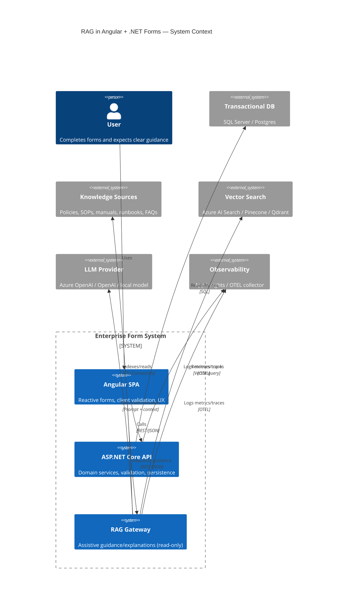
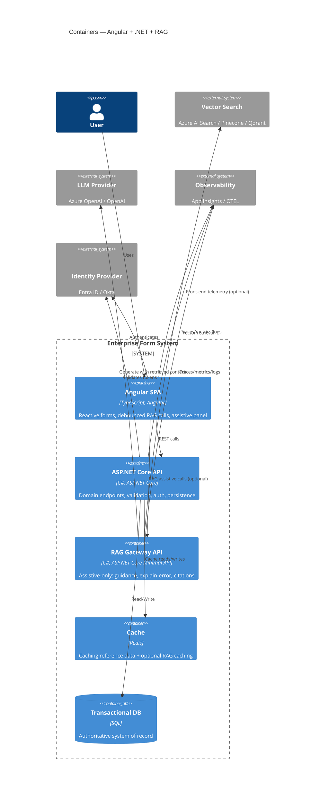
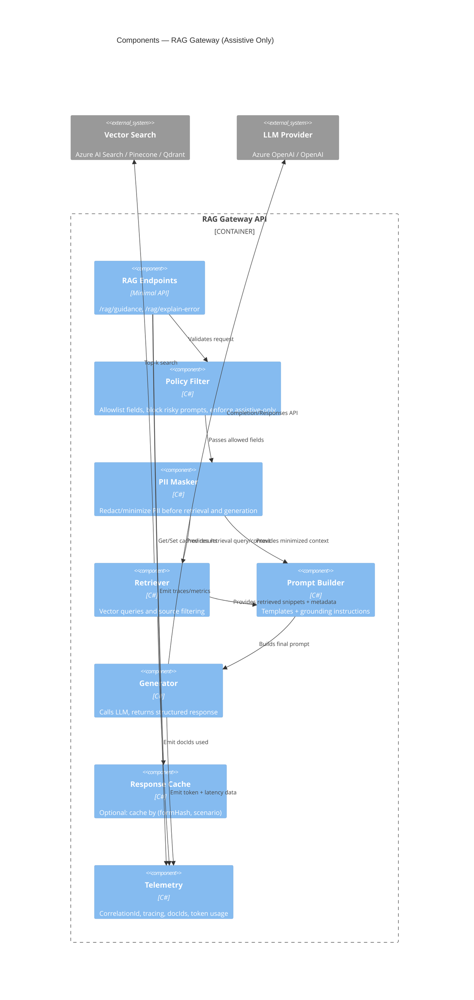
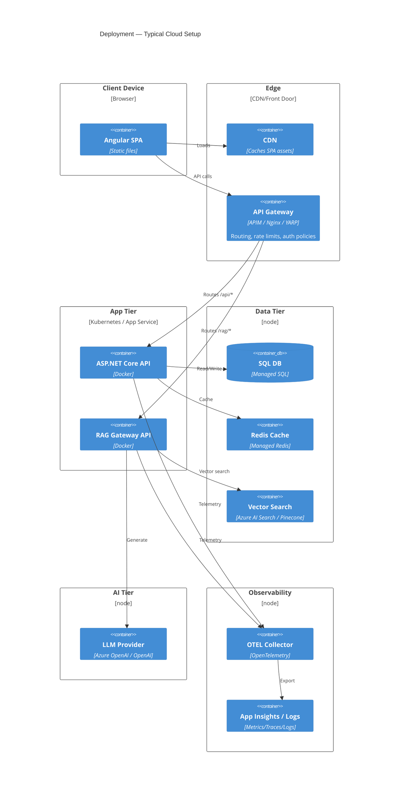
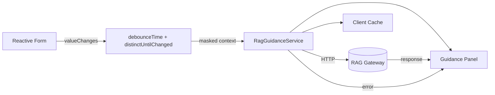

# 1) Full Mermaid C4 Model

> Mermaid’s C4 requires the `C4` diagrams. Paste each block into a Mermaid-enabled markdown page.

## 1.1 C4 Context



---

## 1.2 C4 Container



---

## 1.3 C4 Component (RAG Gateway internals)



---

## 1.4 C4 Deployment



---

# 2) .NET Implementation Skeleton (RAG Gateway)

This is a **Minimal API** skeleton you can drop into a new project.

## 2.1 Contracts (DTOs)

```csharp
// Contracts/RagDtos.cs
namespace RagGateway.Contracts;

public sealed record RagGuidanceRequest(
    string Scenario,                 // e.g. "AddressAssist" or "ExplainError"
    Dictionary<string, object?> FormContext, // minimized client context
    string? ErrorCode = null,
    string? Locale = "en-US"
);

public sealed record RagCitation(
    string SourceId,     // doc id
    string Title,
    string Snippet,
    string? Url = null
);

public sealed record RagGuidanceResponse(
    string GuidanceMarkdown,
    IReadOnlyList<RagCitation> Citations,
    string CorrelationId
);
```

---

## 2.2 Policy + Masking (assistive-only + PII minimization)

```csharp
// Core/Policy/RequestPolicy.cs
using System.Text.RegularExpressions;

namespace RagGateway.Core.Policy;

public sealed class RequestPolicy
{
    // Allowlist only the fields you want RAG to see (architect-controlled).
    // Keep this tight. Expand deliberately.
    private static readonly HashSet<string> AllowedKeys = new(StringComparer.OrdinalIgnoreCase)
    {
        "countryId", "countryName",
        "stateId", "stateName",
        "city", "postalCode",
        "addressValidationResult",
        "fieldInFocus",
        "missingFields",
        "formStep",
        "uiErrorCode",
        "domain",            // optional, e.g. "StudentIntake"
        "entityType"         // optional
    };

    public Dictionary<string, object?> Filter(Dictionary<string, object?> raw)
    {
        var filtered = new Dictionary<string, object?>(StringComparer.OrdinalIgnoreCase);
        foreach (var (k, v) in raw)
        {
            if (AllowedKeys.Contains(k))
                filtered[k] = v;
        }
        return filtered;
    }

    public void ValidateScenario(string scenario)
    {
        // keep scenarios explicitly enumerated
        var allowed = new[] { "AddressAssist", "ExplainError", "FieldHelp" };
        if (!allowed.Contains(scenario, StringComparer.OrdinalIgnoreCase))
            throw new InvalidOperationException($"Scenario '{scenario}' not allowed.");
    }
}

// Core/Policy/PiiMasker.cs
namespace RagGateway.Core.Policy;

public sealed class PiiMasker
{
    public Dictionary<string, object?> Mask(Dictionary<string, object?> filtered)
    {
        // In this pattern, we *avoid* sending PII at all by allowlisting.
        // Still, sanitize string values defensively.
        var result = new Dictionary<string, object?>(StringComparer.OrdinalIgnoreCase);

        foreach (var (k, v) in filtered)
        {
            if (v is string s)
            {
                // Example: remove obvious email/phone patterns if they slipped in
                s = RedactEmail(s);
                s = RedactPhone(s);
                result[k] = s;
            }
            else
            {
                result[k] = v;
            }
        }

        return result;
    }

    private static string RedactEmail(string s) =>
        System.Text.RegularExpressions.Regex.Replace(s,
            @"[A-Z0-9._%+-]+@[A-Z0-9.-]+\.[A-Z]{2,}", "[REDACTED_EMAIL]",
            System.Text.RegularExpressions.RegexOptions.IgnoreCase);

    private static string RedactPhone(string s) =>
        System.Text.RegularExpressions.Regex.Replace(s,
            @"\+?\d[\d\-\s\(\)]{7,}\d", "[REDACTED_PHONE]");
}
```

---

## 2.3 Retriever + Vector Search Abstraction

```csharp
// Core/Retrieval/IRetriever.cs
namespace RagGateway.Core.Retrieval;

public sealed record RetrievedChunk(
    string SourceId,
    string Title,
    string Snippet,
    string? Url,
    float Score
);

public interface IRetriever
{
    Task<IReadOnlyList<RetrievedChunk>> RetrieveAsync(
        string scenario,
        Dictionary<string, object?> maskedContext,
        CancellationToken ct);
}
```

Example in-memory stub (so you can test end-to-end before wiring Azure AI Search):

```csharp
// Infrastructure/Retrieval/InMemoryRetriever.cs
using RagGateway.Core.Retrieval;

namespace RagGateway.Infrastructure.Retrieval;

public sealed class InMemoryRetriever : IRetriever
{
    public Task<IReadOnlyList<RetrievedChunk>> RetrieveAsync(
        string scenario,
        Dictionary<string, object?> maskedContext,
        CancellationToken ct)
    {
        // Replace with real vector search.
        IReadOnlyList<RetrievedChunk> chunks =
        [
            new RetrievedChunk(
                SourceId: "POLICY-ADDR-12",
                Title: "Address Policy: Line2 Requirements",
                Snippet: "In some regions, Address Line 2 is required when building/unit is present...",
                Url: null,
                Score: 0.82f)
        ];

        return Task.FromResult(chunks);
    }
}
```

---

## 2.4 Prompt Builder (grounding + “assistive-only” guardrails)

```csharp
// Core/Prompting/PromptBuilder.cs
using RagGateway.Core.Retrieval;
using System.Text;

namespace RagGateway.Core.Prompting;

public sealed class PromptBuilder
{
    public string Build(string scenario, Dictionary<string, object?> context, IReadOnlyList<RetrievedChunk> chunks)
    {
        var sb = new StringBuilder();

        sb.AppendLine("You are an assistant embedded in a form-based enterprise app.");
        sb.AppendLine("Rules:");
        sb.AppendLine("- You are ASSISTIVE ONLY. Do not make final decisions. Do not claim validation authority.");
        sb.AppendLine("- Do not request or output sensitive personal data.");
        sb.AppendLine("- If missing information is needed, suggest what to enter without guessing.");
        sb.AppendLine("- Keep answers short, actionable, and specific to the user’s context.");
        sb.AppendLine();

        sb.AppendLine($"Scenario: {scenario}");
        sb.AppendLine("Form context (masked/minimized):");
        foreach (var (k, v) in context)
            sb.AppendLine($"- {k}: {v}");

        sb.AppendLine();
        sb.AppendLine("Retrieved references:");
        foreach (var c in chunks.OrderByDescending(x => x.Score).Take(8))
        {
            sb.AppendLine($"- [{c.SourceId}] {c.Title}: {c.Snippet}");
        }

        sb.AppendLine();
        sb.AppendLine("Task: Provide user-facing guidance in Markdown with bullet steps and any caveats.");
        sb.AppendLine("Also provide a short 'Why this happened' section if scenario is ExplainError.");
        return sb.ToString();
    }
}
```

---

## 2.5 Generator Abstraction (LLM client)

```csharp
// Core/Generation/IGenerator.cs
namespace RagGateway.Core.Generation;

public interface IGenerator
{
    Task<string> GenerateAsync(string prompt, CancellationToken ct);
}
```

Stub:

```csharp
// Infrastructure/Generation/FakeGenerator.cs
using RagGateway.Core.Generation;

namespace RagGateway.Infrastructure.Generation;

public sealed class FakeGenerator : IGenerator
{
    public Task<string> GenerateAsync(string prompt, CancellationToken ct)
    {
        // Replace with Azure OpenAI/OpenAI client call.
        var answer = """
        ### What to do next
        - Confirm the **State** is selected for the chosen country.
        - Enter the **postal code** in the correct format for that region.
        - If the address includes an apartment/unit, include it in **Address Line 2**.

        ### Why this might be happening
        Some regions require unit/building info when a postal code maps to multi-unit zones.
        """;
        return Task.FromResult(answer);
    }
}
```

---

## 2.6 Endpoint Wiring (Minimal API) + Correlation IDs

```csharp
// Program.cs
using RagGateway.Contracts;
using RagGateway.Core.Generation;
using RagGateway.Core.Policy;
using RagGateway.Core.Prompting;
using RagGateway.Core.Retrieval;
using RagGateway.Infrastructure.Generation;
using RagGateway.Infrastructure.Retrieval;

var builder = WebApplication.CreateBuilder(args);

builder.Services.AddSingleton<RequestPolicy>();
builder.Services.AddSingleton<PiiMasker>();
builder.Services.AddSingleton<PromptBuilder>();
builder.Services.AddSingleton<IRetriever, InMemoryRetriever>();
builder.Services.AddSingleton<IGenerator, FakeGenerator>();

builder.Services.AddHttpContextAccessor();

var app = builder.Build();

// Simple correlation id middleware
app.Use(async (ctx, next) =>
{
    var cid = ctx.Request.Headers.TryGetValue("X-Correlation-Id", out var v) && !string.IsNullOrWhiteSpace(v)
        ? v.ToString()
        : Guid.NewGuid().ToString("N");

    ctx.Items["CorrelationId"] = cid;
    ctx.Response.Headers["X-Correlation-Id"] = cid;

    await next();
});

app.MapPost("/rag/guidance", async (
    RagGuidanceRequest req,
    RequestPolicy policy,
    PiiMasker masker,
    IRetriever retriever,
    PromptBuilder promptBuilder,
    IGenerator generator,
    IHttpContextAccessor http,
    CancellationToken ct) =>
{
    policy.ValidateScenario(req.Scenario);

    var filtered = policy.Filter(req.FormContext);
    var masked = masker.Mask(filtered);

    var chunks = await retriever.RetrieveAsync(req.Scenario, masked, ct);
    var prompt = promptBuilder.Build(req.Scenario, masked, chunks);

    var guidance = await generator.GenerateAsync(prompt, ct);

    var citations = chunks
        .OrderByDescending(c => c.Score)
        .Take(6)
        .Select(c => new RagCitation(c.SourceId, c.Title, c.Snippet, c.Url))
        .ToList();

    var cid = (string?)http.HttpContext?.Items["CorrelationId"] ?? Guid.NewGuid().ToString("N");

    return Results.Ok(new RagGuidanceResponse(guidance, citations, cid));
});

app.MapPost("/rag/explain-error", async (
    RagGuidanceRequest req,
    RequestPolicy policy,
    PiiMasker masker,
    IRetriever retriever,
    PromptBuilder promptBuilder,
    IGenerator generator,
    IHttpContextAccessor http,
    CancellationToken ct) =>
{
    // reuse same pipeline; scenario should be ExplainError
    policy.ValidateScenario(req.Scenario);

    var filtered = policy.Filter(req.FormContext);
    if (!string.IsNullOrWhiteSpace(req.ErrorCode))
        filtered["uiErrorCode"] = req.ErrorCode;

    var masked = masker.Mask(filtered);

    var chunks = await retriever.RetrieveAsync(req.Scenario, masked, ct);
    var prompt = promptBuilder.Build(req.Scenario, masked, chunks);

    var guidance = await generator.GenerateAsync(prompt, ct);

    var citations = chunks
        .OrderByDescending(c => c.Score)
        .Take(6)
        .Select(c => new RagCitation(c.SourceId, c.Title, c.Snippet, c.Url))
        .ToList();

    var cid = (string?)http.HttpContext?.Items["CorrelationId"] ?? Guid.NewGuid().ToString("N");
    return Results.Ok(new RagGuidanceResponse(guidance, citations, cid));
});

app.Run();
```

✅ This is a working skeleton today (with stubbed retriever + generator).
Next step would be replacing:

* `InMemoryRetriever` → Azure AI Search / Pinecone / Qdrant
* `FakeGenerator` → Azure OpenAI / OpenAI

---

# 3) Angular UX Pattern (Debounced, Cached, Non-Blocking)

Goal: the form remains **fully functional** even if RAG fails.

## 3.1 UI Pattern Diagram



---

## 3.2 Service: Debounce + Hash key + Cache + Cancellation

```ts
// rag-guidance.service.ts
import { Injectable } from '@angular/core';
import { HttpClient, HttpHeaders } from '@angular/common/http';
import { Observable, of, timer } from 'rxjs';
import { catchError, map, shareReplay, switchMap } from 'rxjs/operators';

export interface RagGuidanceRequest {
  scenario: 'AddressAssist' | 'ExplainError' | 'FieldHelp';
  formContext: Record<string, any>;
  errorCode?: string;
  locale?: string;
}

export interface RagCitation {
  sourceId: string;
  title: string;
  snippet: string;
  url?: string;
}

export interface RagGuidanceResponse {
  guidanceMarkdown: string;
  citations: RagCitation[];
  correlationId: string;
}

@Injectable({ providedIn: 'root' })
export class RagGuidanceService {
  private cache = new Map<string, Observable<RagGuidanceResponse>>();

  constructor(private http: HttpClient) {}

  getGuidance(req: RagGuidanceRequest): Observable<RagGuidanceResponse> {
    const normalized = this.minimizeContext(req.formContext);
    const cacheKey = this.hashKey(req.scenario, req.errorCode, req.locale, normalized);

    const cached = this.cache.get(cacheKey);
    if (cached) return cached;

    const headers = new HttpHeaders({
      'X-Correlation-Id': crypto.randomUUID().replace(/-/g, ''),
    });

    const call$ = this.http
      .post<RagGuidanceResponse>(
        `/rag/${req.scenario === 'ExplainError' ? 'explain-error' : 'guidance'}`,
        { ...req, formContext: normalized },
        { headers }
      )
      .pipe(
        // shareReplay ensures multiple subscribers reuse the same request
        shareReplay({ bufferSize: 1, refCount: true }),
        catchError(() =>
          of({
            guidanceMarkdown:
              'Unable to load guidance right now. You can continue filling the form normally.',
            citations: [],
            correlationId: headers.get('X-Correlation-Id') || '',
          })
        )
      );

    this.cache.set(cacheKey, call$);

    // optional: expire cache after 5 minutes
    timer(5 * 60 * 1000).subscribe(() => this.cache.delete(cacheKey));

    return call$;
  }

  private minimizeContext(ctx: Record<string, any>): Record<string, any> {
    // Keep it aligned with backend allowlist. Avoid PII by design.
    const allow = [
      'countryId',
      'countryName',
      'stateId',
      'stateName',
      'city',
      'postalCode',
      'fieldInFocus',
      'missingFields',
      'formStep',
      'addressValidationResult',
      'uiErrorCode',
      'domain',
      'entityType',
    ];

    const out: Record<string, any> = {};
    for (const k of allow) {
      if (ctx[k] !== undefined && ctx[k] !== null && ctx[k] !== '') out[k] = ctx[k];
    }
    return out;
  }

  private hashKey(...parts: any[]): string {
    // Simple stable key (good enough). You can swap with a real hashing function.
    return btoa(unescape(encodeURIComponent(JSON.stringify(parts))));
  }
}
```

---

## 3.3 Component Pattern: Side Panel Guidance (non-blocking)

```ts
// address-form.component.ts
import { Component, OnDestroy, OnInit } from '@angular/core';
import { FormBuilder, Validators } from '@angular/forms';
import { Subject } from 'rxjs';
import { debounceTime, distinctUntilChanged, map, takeUntil, switchMap } from 'rxjs/operators';
import { RagGuidanceService, RagGuidanceResponse } from './rag-guidance.service';

@Component({
  selector: 'app-address-form',
  templateUrl: './address-form.component.html',
})
export class AddressFormComponent implements OnInit, OnDestroy {
  private destroy$ = new Subject<void>();

  guidance?: RagGuidanceResponse;
  guidanceLoading = false;

  form = this.fb.group({
    countryId: ['', Validators.required],
    stateId: [''],
    city: [''],
    postalCode: [''],
  });

  constructor(private fb: FormBuilder, private rag: RagGuidanceService) {}

  ngOnInit(): void {
    this.form.valueChanges
      .pipe(
        debounceTime(400),
        map(v => ({
          scenario: 'AddressAssist' as const,
          formContext: {
            countryId: v.countryId,
            stateId: v.stateId,
            city: v.city,
            postalCode: v.postalCode,
            fieldInFocus: this.getFieldInFocus(),
            missingFields: this.getMissingFields(),
            formStep: 'Address',
          },
          locale: 'en-US',
        })),
        distinctUntilChanged((a, b) => JSON.stringify(a) === JSON.stringify(b)),
        takeUntil(this.destroy$),
        switchMap(req => {
          this.guidanceLoading = true;
          return this.rag.getGuidance(req);
        })
      )
      .subscribe(res => {
        this.guidance = res;
        this.guidanceLoading = false;
      });
  }

  ngOnDestroy(): void {
    this.destroy$.next();
    this.destroy$.complete();
  }

  private getMissingFields(): string[] {
    const missing: string[] = [];
    const v = this.form.value;
    if (!v.countryId) missing.push('countryId');
    // add whatever is relevant
    return missing;
  }

  private getFieldInFocus(): string {
    // Optional: implement focus tracking in template
    return 'postalCode';
  }
}
```

Template:

```html
<!-- address-form.component.html -->
<div class="layout">
  <form [formGroup]="form" class="form">
    <!-- country/state/city/postal inputs -->
  </form>

  <aside class="assist-panel">
    <div *ngIf="guidanceLoading">Loading guidance…</div>

    <div *ngIf="!guidanceLoading && guidance">
      <div class="markdown">
        <!-- render markdown with your preferred library -->
        <pre>{{ guidance.guidanceMarkdown }}</pre>
      </div>

      <div *ngIf="guidance.citations?.length">
        <h4>References</h4>
        <ul>
          <li *ngFor="let c of guidance.citations">
            <strong>{{ c.title }}</strong>
            <div>{{ c.snippet }}</div>
          </li>
        </ul>
      </div>

      <small *ngIf="guidance.correlationId">
        Correlation: {{ guidance.correlationId }}
      </small>
    </div>
  </aside>
</div>
```
