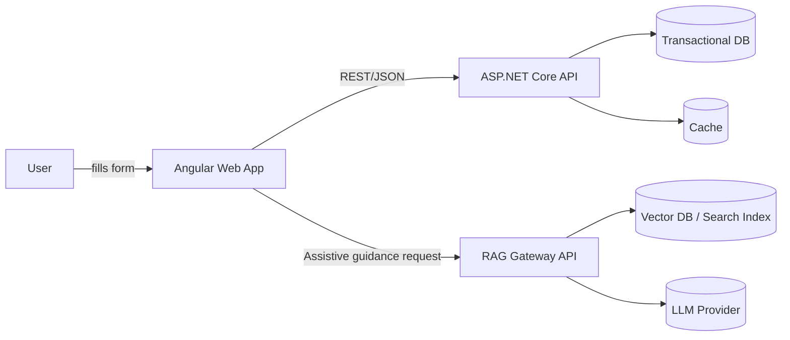
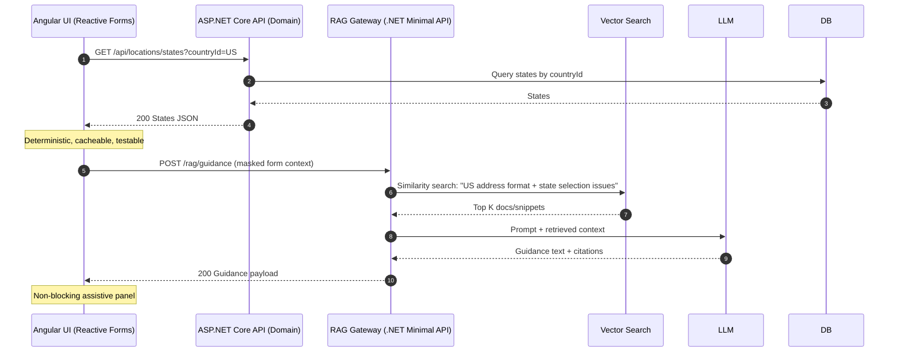
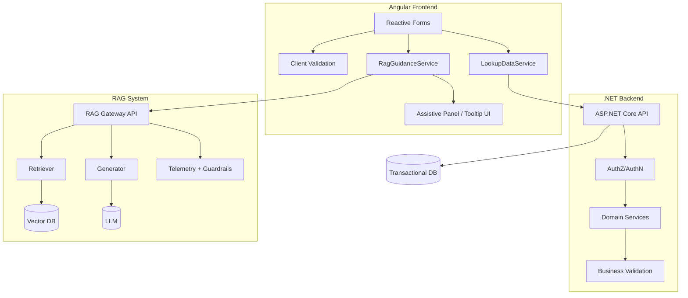
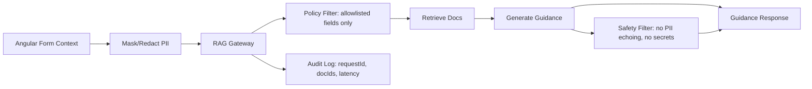
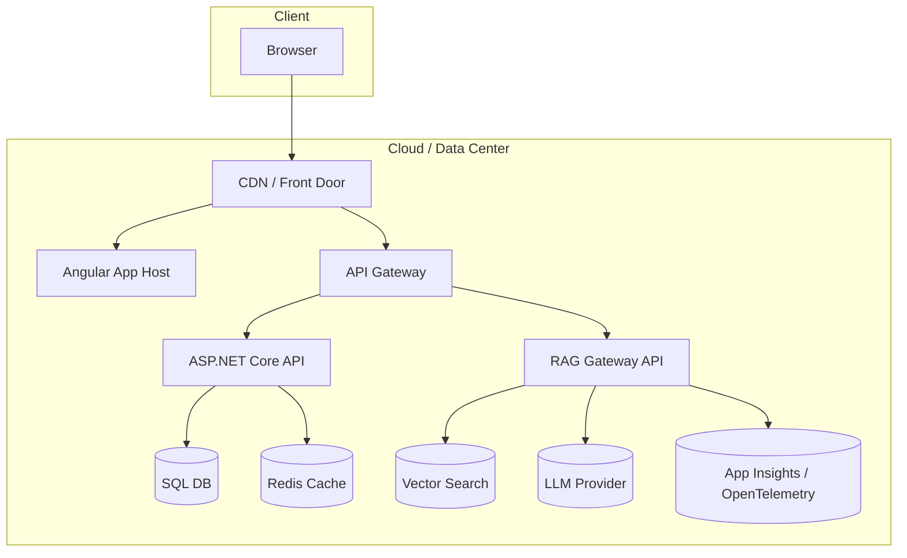
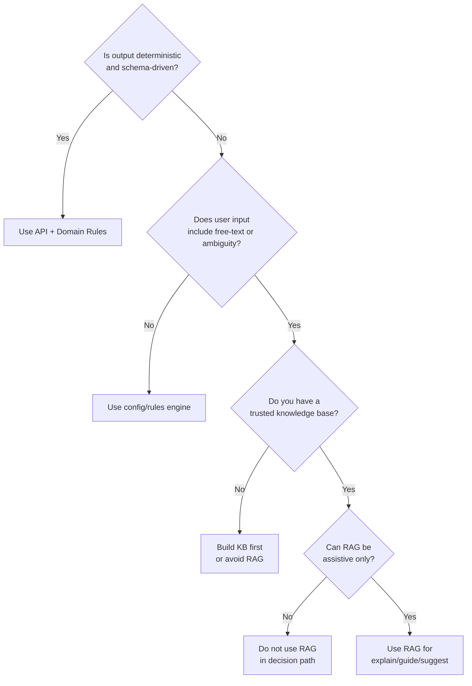
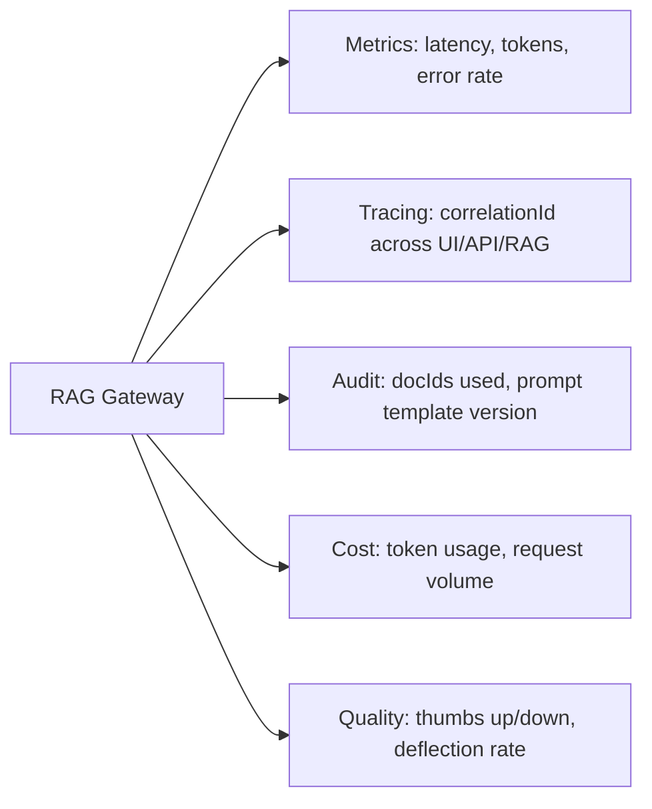

## Diagram-Heavy Reference Architecture

---

## 1) System Context Diagram



**Intent:** RAG is **parallel** to your transactional API path.
Your form still works without RAG.

---

## 2) Request Flow: Deterministic Data vs RAG Guidance



---

## 3) Component Architecture: Clean Boundaries



**Key rule:** RAG stays out of domain validation and persistence.

---

## 4) Data Classification & PII Guardrail Flow



**Implementation note (architectural):**

* Do not send raw first/last name, full address, phone, SSN, DOB to RAG unless you have a compelling reason and appropriate governance.
* Prefer **field-level summarization** (“Country=US, State empty, City filled, Zip invalid”) vs raw values.

---

## 5) Deployment View (Typical Enterprise)



---

## 6) “Golden Path” Use Case: Inline Explanation for Rejections

Use case: Backend rejects submit; RAG explains **why** in human terms.

```mermaid
sequenceDiagram
  autonumber
  participant UI as Angular UI
  participant API as ASP.NET Core API
  participant RAG as RAG Gateway
  participant V as Vector DB
  participant L as LLM

  UI->>API: POST /api/profile (form payload)
  API-->>UI: 409 VALIDATION_ERROR { code: "ADDR_POLICY_12" }

  UI->>RAG: POST /rag/explain-error { code, maskedContext }
  RAG->>V: Retrieve doc snippets for code ADDR_POLICY_12
  V-->>RAG: Policy excerpt + examples
  RAG->>L: Generate explanation + actionable steps
  L-->>RAG: "Address line 2 required for X; examples..."
  RAG-->>UI: Guidance response with doc references

  Note over UI: UI shows helpful guidance instead of cryptic error codes.
```

---

## 7) RAG Decision Matrix as a Flowchart



---

## 8) Observability & Governance Diagram (Non-Negotiable)



**This is how you keep RAG from becoming a black box.**

---

# Recommended “Architect’s Rules” (Short and Sharp)

1. **RAG is not authoritative.** Domain logic stays in ASP.NET Core services.
2. **RAG is optional.** Form UX must function if RAG is down.
3. **RAG is read-only.** No writes, no decisions, no validation outcomes.
4. **PII is minimized.** Redact/mask before retrieval/generation.
5. **Everything is observable.** Correlation IDs + doc IDs + prompt version.
